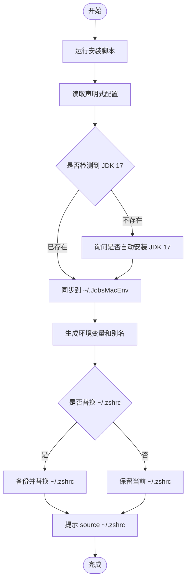

# 🌍 [**JobsMacEnvVarConfig**](https://github.com/JobsKits/JobsMacEnvVarConfig)


[toc]

## 🔥 <font id=前言>前言</font>

* 这是一个面向 **MacOS** 的个人开发环境配置同步项目。

* 它把零散堆在 `~/.zshrc`、`~/.bash_profile` 里的环境变量、PATH、别名和个人命令拆分成模块，并通过 `install.command` 同步到用户目录 `~/.JobsMacEnv`。

## 一、适合解决什么问题 <a href="#前言" style="font-size:17px; color:green;"><b>🔼</b></a> <a href="#🔚" style="font-size:17px; color:green;"><b>🔽</b></a>

- 新 Mac 初始化开发环境时，快速恢复常用 Shell 配置。
- 避免把所有配置都塞进一个巨大的 `~/.zshrc`。
- 统一管理 **Java**、**Android**、**Flutter**、**Node**、**Rust**、**Python**、**Ruby**、**Go** 等开发环境入口。
- 让系统级 `~/.zshrc` 保持轻量，只负责加载 `~/.JobsMacEnv`。
- 支持本机私有配置和公共配置分离。

## 二、目录结构 <a href="#前言" style="font-size:17px; color:green;"><b>🔼</b></a> <a href="#🔚" style="font-size:17px; color:green;"><b>🔽</b></a>

```text
.
├── install.command                 # 主安装 / 同步脚本
├── sync_env.txt                    # 声明式环境配置
├── icon.png                        # 项目图标
├── Sys/
│   ├── .zshrc                      # 轻量 zsh 主入口模板
│   ├── .zprofile
│   ├── .zshenv
│   ├── .zlogin
│   ├── .zlogout
│   ├── .bashrc
│   └── .bash_profile
├── scripts/
│   └── install_jdk17.command       # JDK 17 独立安装脚本
└── zsh/
    ├── bootstrap.zsh               # 启动层：交互式环境、Oh My Zsh、Homebrew
    ├── env_methods.zsh             # 环境变量 / PATH 工具方法
    ├── aliases.zsh                 # 自动生成的别名文件
    ├── user_mounts.zsh             # 自定义模块挂载入口
    └── custom/
        ├── shell_behavior.zsh      # 交互式终端行为
        ├── path_drag_resolver.zsh  # macOS 拖入路径解析
        ├── legacy_functions.zsh    # 从旧配置拆出的个人命令集合
        └── local.zsh               # 本机私有配置
```

安装后会同步到：

```text
~/.JobsMacEnv
├── .zshrc
├── install.command
├── sync_env.txt
├── README.md
├── scripts/
└── zsh/
```

## 三、安装方式 <a href="#前言" style="font-size:17px; color:green;"><b>🔼</b></a> <a href="#🔚" style="font-size:17px; color:green;"><b>🔽</b></a>

进入项目目录后执行：

```bash
chmod +x install.command
./install.command
```

也可以在 **Finder** 中双击 `install.command` 执行。

安装过程中会询问：

1. 是否继续安装
2. 是否自动安装 JDK 17
3. 是否替换当前系统 `~/.zshrc`

如果选择替换 `~/.zshrc`，脚本会先自动备份旧文件：

```text
~/.zshrc.backup.YYYYMMDDHHMMSS
```

安装完成后，立即生效：

```bash
source ~/.zshrc
```

## 四、安装流程 <a href="#前言" style="font-size:17px; color:green;"><b>🔼</b></a> <a href="#🔚" style="font-size:17px; color:green;"><b>🔽</b></a>



## 五、配置入口 <a href="#前言" style="font-size:17px; color:green;"><b>🔼</b></a> <a href="#🔚" style="font-size:17px; color:green;"><b>🔽</b></a>

### 1、声明式环境配置 <a href="#前言" style="font-size:17px; color:green;"><b>🔼</b></a> <a href="#🔚" style="font-size:17px; color:green;"><b>🔽</b></a>

主要修改：

```text
sync_env.txt
```

示例：

```ini
[JAVA]
JAVA_VERSION=17
JAVA_CANDIDATES=temurin@17,zulu@17,openjdk@17

[ANDROID]
ANDROID_SDK_DEFAULT=$HOME/Library/Android/sdk

[FLUTTER]
USE_FVM=true
FLUTTER_CANDIDATES=$HOME/fvm/default/bin,$HOME/development/flutter/bin

[NODE]
ENABLE_PNPM=true
ENABLE_COREPACK=true
NVM_DIR=$HOME/.nvm

[PATH]
$HOME/bin
$HOME/.local/bin
$HOME/.pub-cache/bin
$HOME/.cargo/bin
$HOME/go/bin

[ALIASES]
ll=ls -alF
gs=git status
ga=git add .
gc=git commit
gp=git push
gl=git pull
```

执行安装脚本后，会根据 `sync_env.txt` 生成：

```text
~/.JobsMacEnv/zsh/env.zsh
~/.JobsMacEnv/zsh/aliases.zsh
```

因此不要直接长期手改这两个生成文件。需要变更时，优先改 `sync_env.txt`。

### 2、本机私有配置 <a href="#前言" style="font-size:17px; color:green;"><b>🔼</b></a> <a href="#🔚" style="font-size:17px; color:green;"><b>🔽</b></a>

本机专属内容放这里：

```text
zsh/custom/local.zsh
```

适合放：

- 个人项目路径
- 私有别名
- 不适合提交到公共模板里的配置
- 临时开关

例如开启拖入路径自动解析：

```zsh
export JOBS_ALIAS_DRAG_AUTO_RESOLVE=true
```

## 六、已支持的环境 <a href="#前言" style="font-size:17px; color:green;"><b>🔼</b></a> <a href="#🔚" style="font-size:17px; color:green;"><b>🔽</b></a>

| 类型 | 说明 |
|---|---|
| Java | 自动解析 JDK 版本，默认 JDK 17 |
| Android | 配置 Android SDK、platform-tools、emulator 等路径 |
| Flutter | 支持 FVM 优先，也支持普通 Flutter SDK 路径 |
| Node | 支持 NVM、Corepack、PNPM |
| Rust | 支持 Cargo 路径 |
| Python | 支持 pyenv |
| Ruby | 支持 rbenv |
| Go | 支持 GOPATH 和 Go bin 路径 |
| Homebrew | 自动兼容 Apple Silicon 和 Intel 路径 |

## 七、常用能力 <a href="#前言" style="font-size:17px; color:green;"><b>🔼</b></a> <a href="#🔚" style="font-size:17px; color:green;"><b>🔽</b></a>

### 1、轻量 zsh 主入口 <a href="#前言" style="font-size:17px; color:green;"><b>🔼</b></a> <a href="#🔚" style="font-size:17px; color:green;"><b>🔽</b></a>

系统 `~/.zshrc` 只负责加载：

```zsh
export JOBS_MAC_ENV_HOME="$HOME/.JobsMacEnv"

jobs_source_if_exists "$JOBS_MAC_ENV_HOME/zsh/bootstrap.zsh"
jobs_source_if_exists "$JOBS_MAC_ENV_HOME/zsh/env_methods.zsh"
jobs_source_if_exists "$JOBS_MAC_ENV_HOME/zsh/env.zsh"
jobs_source_if_exists "$JOBS_MAC_ENV_HOME/zsh/aliases.zsh"
jobs_source_if_exists "$JOBS_MAC_ENV_HOME/zsh/user_mounts.zsh"
```

核心配置都在 `~/.JobsMacEnv` 下维护。

### 2、macOS 路径拖入解析 <a href="#前言" style="font-size:17px; color:green;"><b>🔼</b></a> <a href="#🔚" style="font-size:17px; color:green;"><b>🔽</b></a>

`path_drag_resolver.zsh` 用来处理 Finder 拖入终端的路径。

默认快捷键：

```text
Ctrl + G
```

作用：把当前命令行最后一个路径参数解析成真实路径，支持：

- Finder 替身文件
- Unix 软链接
- 普通文件和目录
- 带空格、括号、转义字符的路径

### 3、便捷命令

`local.zsh` 中包含一些面向日常使用的命令：

```zsh
zz <路径>
```

跳转到真实目录。如果目标是文件，则进入文件所在目录。

```zsh
x <脚本文件>
```

自动 `chmod +x` 并执行脚本文件。

```zsh
download <url>
```

使用 `yt-dlp` 下载链接，并自动尝试读取默认浏览器 cookies。

## 八、更新配置 <a href="#前言" style="font-size:17px; color:green;"><b>🔼</b></a> <a href="#🔚" style="font-size:17px; color:green;"><b>🔽</b></a>

修改项目里的配置后，重新执行：

```bash
./install.command
```

脚本会把配置同步到：

```text
~/.JobsMacEnv
```

如果文件内容没有变化，会自动跳过重复写入。

## 九、注意事项 <a href="#前言" style="font-size:17px; color:green;"><b>🔼</b></a> <a href="#🔚" style="font-size:17px; color:green;"><b>🔽</b></a>

- 本项目主要面向 MacOS + zsh。
- 自动安装 JDK 17 依赖 [**Homebrew**](https://brew.sh/)。
- 替换 `~/.zshrc` 前会自动备份，但仍建议先确认当前配置没有重要未迁移内容。
- `env.zsh` 和 `aliases.zsh` 是生成文件，不建议直接长期手改。
- `legacy_functions.zsh` 是从旧配置拆出来的个人命令集合，里面可能包含固定项目路径；迁移到新机器后建议先检查再使用。
- 如果安装后没有立即生效，执行 `source ~/.zshrc`，或者重新打开终端。

## 10、推荐维护方式 <a href="#前言" style="font-size:17px; color:green;"><b>🔼</b></a> <a href="#🔚" style="font-size:17px; color:green;"><b>🔽</b></a>

```text
公共、可复用配置     -> sync_env.txt / zsh/*.zsh
本机专属配置         -> zsh/custom/local.zsh
旧命令临时保留       -> zsh/custom/legacy_functions.zsh
系统入口             -> ~/.zshrc 只保留加载入口
实际运行目录         -> ~/.JobsMacEnv
```

**核心原则：**

```text
系统入口要轻，环境逻辑要拆，个人配置要隔离，生成文件不要手改。
```

<a id="🔚" href="#前言" style="font-size:17px; color:green; font-weight:bold;">我是有底线的➤点我回到首页</a>
