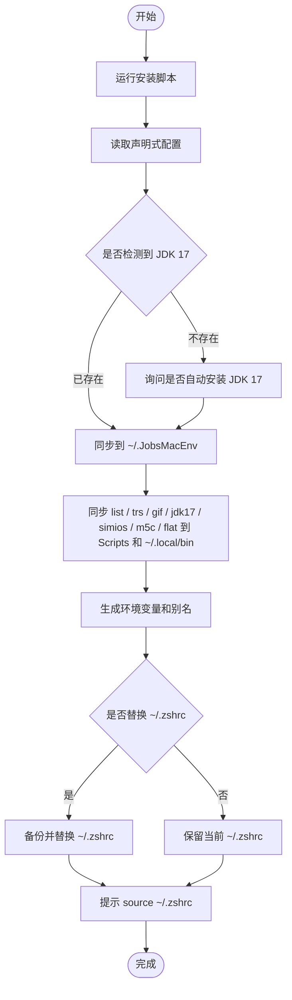

# 🌍 [**JobsMacEnvVarConfig**](https://github.com/JobsKits/JobsMacEnvVarConfig)


[toc]

## 🔥 <font id=前言>前言</font>

* 这是一个面向 **MacOS** 的个人开发环境配置同步项目。

* 它把零散堆在 `~/.zshrc`、`~/.bash_profile` 里的环境变量、PATH、别名和个人命令拆分成模块，并通过 `install.command` 同步到用户目录 `~/.JobsMacEnv`。

## 一、适合解决什么问题 <a href="#前言" style="font-size:17px; color:green;"><b>🔼</b></a> <a href="#🔚" style="font-size:17px; color:green;"><b>🔽</b></a>

- 新 Mac 初始化开发环境时，快速恢复常用 Shell 配置。
- 避免把所有配置都塞进一个巨大的 `~/.zshrc`。
- 统一管理 **Java**、**Android**、**Flutter**、**Node**、**Rust**、**Python**、**Ruby**、**Go** 等开发环境入口。
- 让系统级 `~/.zshrc` 保持轻量，只负责加载 `~/.JobsMacEnv`。
- 支持本机私有配置和公共配置分离。

## 二、目录结构 <a href="#前言" style="font-size:17px; color:green;"><b>🔼</b></a> <a href="#🔚" style="font-size:17px; color:green;"><b>🔽</b></a>

```text
.
├── install.command                 # 主安装 / 同步脚本
├── sync_env.txt                    # 声明式环境配置
├── icon.png                        # 项目图标
├── Sys/
│   ├── .zshrc                      # 轻量 zsh 主入口模板
│   ├── .zprofile
│   ├── .zshenv
│   ├── .zlogin
│   ├── .zlogout
│   ├── .bashrc
│   └── .bash_profile
├── Scripts/
│   ├── install_jdk17.command/
│   │   ├── install_jdk17.command   # JDK 17 独立安装脚本
│   │   └── README.md               # 对应自述与流程图
│   ├── trs.command/
│   │   ├── trs.command             # macOS 原生翻译入口脚本
│   │   └── README.md
│   ├── gif.command/
│   │   ├── gif.command             # 终端 / 全屏录制并转 GIF 脚本
│   │   └── README.md
│   ├── simios.command/
│   │   ├── simios.command          # Xcode iOS Simulator Runtime 下载 / 补齐脚本
│   │   └── README.md
│   ├── list.command/
│   │   ├── list.command            # fzf 功能菜单总入口
│   │   └── README.md
│   ├── m5c.command/
│   │   ├── m5c.command             # MD5 文件一致性比较工具
│   │   └── README.md
│   ├── 【MacOS】去乱码.command/
│   │   ├── 【MacOS】去乱码.command  # URL 编码去乱码 / 解码工具
│   │   └── README.md
│   └── *.command/                  # 其余模块均按“脚本全名文件夹 + 脚本 + README”管理
└── zsh/
    ├── bootstrap.zsh               # 启动层：交互式环境、Oh My Zsh、Homebrew
    ├── env_methods.zsh             # 环境变量 / PATH 工具方法
    ├── aliases.zsh                 # 自动生成的别名文件
    ├── user_mounts.zsh             # 自定义模块挂载入口
    └── custom/
        ├── shell_behavior.zsh      # 交互式终端行为：默认 cd 桌面、clean 清屏清历史
        ├── path_drag_resolver.zsh  # macOS 拖入路径解析
        └── local.zsh               # Scripts 模块加载器
```

安装后会同步到：

```text
~/.JobsMacEnv
├── .zshrc
├── install.command
├── sync_env.txt
├── README.md
├── Scripts/
│   ├── install_jdk17.command/install_jdk17.command
│   ├── trs.command/trs.command
│   ├── gif.command/gif.command
│   ├── simios.command/simios.command
│   ├── list.command/list.command
│   ├── m5c.command/m5c.command
│   ├── 【MacOS】去乱码.command/【MacOS】去乱码.command
│   └── *.command/*.command
└── zsh/
```

## 三、安装方式 <a href="#前言" style="font-size:17px; color:green;"><b>🔼</b></a> <a href="#🔚" style="font-size:17px; color:green;"><b>🔽</b></a>

进入项目目录后执行：

```bash
chmod +x install.command
./install.command
```

也可以在 **Finder** 中双击 `install.command` 执行。

安装过程中会询问：

1. 是否继续安装
2. 是否自动安装 JDK 17
3. 是否替换当前系统 `~/.zshrc`
4. `list` 可打开 fzf 功能菜单，集中展示可执行能力
5. `m5c` 可比较两个文件的 MD5，判断文件字节内容是否一致
6. `flat` 可对 URL 编码文本执行去乱码 / 解码，并自动复制结果到剪贴板
7. `trs` 首次使用时会对 `fzf` / `translate-cli` 这类必需依赖执行补齐流程
8. `gif` 首次使用时会检测 Homebrew / asciinema / agg / ffmpeg；启动时按回车默认录制当前终端，进入设置菜单可选择全屏录制
9. `simios` 会先检测完整 Xcode / xcode-select / xcodebuild / Xcode license / 首次启动组件，再执行 iOS Simulator Runtime 下载

如果选择替换 `~/.zshrc`，脚本会先自动备份旧文件：

```text
~/.zshrc.backup.YYYYMMDDHHMMSS
```

安装完成后，立即生效：

```bash
source ~/.zshrc
```

## 四、安装流程 <a href="#前言" style="font-size:17px; color:green;"><b>🔼</b></a> <a href="#🔚" style="font-size:17px; color:green;"><b>🔽</b></a>



## 五、配置入口 <a href="#前言" style="font-size:17px; color:green;"><b>🔼</b></a> <a href="#🔚" style="font-size:17px; color:green;"><b>🔽</b></a>

### 1、声明式环境配置 <a href="#前言" style="font-size:17px; color:green;"><b>🔼</b></a> <a href="#🔚" style="font-size:17px; color:green;"><b>🔽</b></a>

主要修改：

```text
sync_env.txt
```

示例：

```ini
[JAVA]
JAVA_VERSION=17
JAVA_CANDIDATES=temurin@17,zulu@17,openjdk@17

[ANDROID]
ANDROID_SDK_DEFAULT=$HOME/Library/Android/sdk

[FLUTTER]
USE_FVM=true
FLUTTER_CANDIDATES=$HOME/fvm/default/bin,$HOME/development/flutter/bin

[NODE]
ENABLE_PNPM=true
ENABLE_COREPACK=true
NVM_DIR=$HOME/.nvm

[PATH]
$HOME/bin
$HOME/.local/bin
$HOME/.pub-cache/bin
$HOME/.cargo/bin
$HOME/go/bin

[ALIASES]
ll=ls -alF
gs=git status
ga=git add .
gc=git commit
gp=git push
gl=git pull
```

执行安装脚本后，会根据 `sync_env.txt` 生成：

```text
~/.JobsMacEnv/zsh/env.zsh
~/.JobsMacEnv/zsh/aliases.zsh
```

因此不要直接长期手改这两个生成文件。需要变更时，优先改 `sync_env.txt`。

### 2、个人终端函数集合 <a href="#前言" style="font-size:17px; color:green;"><b>🔼</b></a> <a href="#🔚" style="font-size:17px; color:green;"><b>🔽</b></a>

个人终端函数和本机专属内容统一放这里：

```text
zsh/custom/local.zsh
```

适合放：

- 个人项目路径
- 私有别名
- 常用 zsh 函数
- 终端快捷命令
- 临时开关

例如开启拖入路径自动解析：

```zsh
export JOBS_ALIAS_DRAG_AUTO_RESOLVE=true
```

个人命令按功能拆到 `Scripts/<脚本全名>/<脚本全名>`，每个脚本文件夹都带独立 `README.md` 和 Mermaid 流程图，`local.zsh` 只负责加载这些模块。

## 六、已支持的环境 <a href="#前言" style="font-size:17px; color:green;"><b>🔼</b></a> <a href="#🔚" style="font-size:17px; color:green;"><b>🔽</b></a>

| 类型 | 说明 |
|---|---|
| Java | 自动解析 JDK 版本，默认 JDK 17 |
| Android | 配置 Android SDK、platform-tools、emulator 等路径 |
| Flutter | 支持 FVM 优先，也支持普通 Flutter SDK 路径 |
| Node | 支持 NVM、Corepack、PNPM |
| Rust | 支持 Cargo 路径 |
| Python | 支持 pyenv |
| Ruby | 支持 rbenv |
| Go | 支持 GOPATH 和 Go bin 路径 |
| Homebrew | 自动兼容 Apple Silicon 和 Intel 路径 |
| trs | macOS 原生翻译入口，中文固定为一端，fzf 选择对方语言 |
| gif | 终端 / 全屏录制入口，基于 asciinema + agg / screencapture + ffmpeg 生成高质量 GIF / MP4 |
| simios | 检测完整 Xcode 环境并下载 / 补齐 iOS Simulator Runtime |
| list | fzf 功能菜单总入口，展示可执行能力并分发到具体脚本 |
| m5c | MD5 文件一致性比较工具，支持输入或拖入两个文件路径 |
| flat | URL 编码去乱码 / 解码工具，支持普通 URL Decode 和 `--plus` 表单编码模式 |

## 七、常用能力 <a href="#前言" style="font-size:17px; color:green;"><b>🔼</b></a> <a href="#🔚" style="font-size:17px; color:green;"><b>🔽</b></a>

### 1、轻量 zsh 主入口 <a href="#前言" style="font-size:17px; color:green;"><b>🔼</b></a> <a href="#🔚" style="font-size:17px; color:green;"><b>🔽</b></a>

系统 `~/.zshrc` 只负责加载：

```zsh
export JOBS_MAC_ENV_HOME="$HOME/.JobsMacEnv"

jobs_source_if_exists "$JOBS_MAC_ENV_HOME/zsh/bootstrap.zsh"
jobs_source_if_exists "$JOBS_MAC_ENV_HOME/zsh/env_methods.zsh"
jobs_source_if_exists "$JOBS_MAC_ENV_HOME/zsh/env.zsh"
jobs_source_if_exists "$JOBS_MAC_ENV_HOME/zsh/aliases.zsh"
jobs_source_if_exists "$JOBS_MAC_ENV_HOME/zsh/user_mounts.zsh"
```

核心配置都在 `~/.JobsMacEnv` 下维护。

### 2、macOS 路径拖入解析 <a href="#前言" style="font-size:17px; color:green;"><b>🔼</b></a> <a href="#🔚" style="font-size:17px; color:green;"><b>🔽</b></a>

`path_drag_resolver.zsh` 用来处理 Finder 拖入终端的路径。

默认快捷键：

```text
Ctrl + G
```

作用：把当前命令行最后一个路径参数解析成真实路径，支持：

- Finder 替身文件
- Unix 软链接
- 普通文件和目录
- 带空格、括号、转义字符的路径

### 3、终端相关自定义函数重点说明 <a href="#前言" style="font-size:17px; color:green;"><b>🔼</b></a> <a href="#🔚" style="font-size:17px; color:green;"><b>🔽</b></a>

这些命令不是系统自带命令，而是本项目挂载到 zsh 里的个人终端能力。加载顺序在：

```zsh
zsh/user_mounts.zsh
```

默认顺序是：

```zsh
shell_behavior.zsh
path_drag_resolver.zsh
local.zsh
```

也就是说，`shell_behavior.zsh` 放终端默认行为，`path_drag_resolver.zsh` 放路径拖入解析，`local.zsh` 只加载 `Scripts/<脚本全名>/<脚本全名>` 模块，并兼容旧版平铺结构 `Scripts/*.command`。


#### 3.0 `list`：功能菜单总入口

来源文件：

```text
Scripts/list.command/list.command
```

用法：

```zsh
list
```

行为：

- 启动后先显示脚本自述文件并等待回车。
- 对 Homebrew 执行健康体检。
- 对 Homebrew 安装的 `fzf` 执行健康体检。
- 使用 `fzf` 展示当前可执行功能。
- 选择功能后分发到对应脚本，例如 `m5c`、`flat`。

注意：

- `list` 命令名非常通用，存在和 alias、函数或第三方工具冲突的风险。
- 安装脚本会检测命令名冲突并给出警告，但不会静默覆盖其他路径里的命令。
- 涉及 Homebrew / fzf 更新时，统一规则是：回车跳过，输入任意字符后回车才执行更新流程。

#### 3.1 `m5c`：MD5 文件一致性比较

来源文件：

```text
Scripts/m5c.command/m5c.command
```

用法：

```zsh
m5c
```

行为：

- 启动后先显示脚本自述文件并等待回车。
- 让用户输入或拖入第一个文件路径。
- 再让用户输入或拖入第二个文件路径。
- 分别计算两个文件的 MD5。
- 输出两个文件的字节内容是否一致。

注意：

- `m5c` 表示 MD5 Compare，命令名短，不覆盖 macOS 系统自带 `md5`。
- MD5 适合日常文件校验和去重，不适合密码、安全签名或强安全校验。

#### 3.2 `flat`：URL 编码去乱码 / 解码

来源文件：

```text
Scripts/【MacOS】去乱码.command/【MacOS】去乱码.command
```

用法：

```zsh
flat
flat "%E4%BD%A0%E5%A5%BD"
flat --plus "hello+world%21"
```

行为：

- 启动后先显示脚本自述文件并等待回车。
- 无参数时进入交互输入，可连续解码多段 URL 编码文本。
- 带参数时逐个解码参数。
- 解码结果会自动复制到系统剪贴板。

注意：

- 默认模式只做标准 URL Decode。
- `--plus` 会把 `+` 解析为空格，适合表单编码内容。
- `flat` 作为去乱码入口，短、好输入，并通过 `list` 菜单展示用途，降低记忆成本。

#### 3.3 `clean`：清除终端历史 + Command+K 式清屏

来源文件：

```text
zsh/custom/shell_behavior.zsh
```

用法：

```zsh
clean
```

执行效果：

- 清空当前 zsh 会话里的历史记录。
- 清空 `HISTFILE` 指向的历史文件，默认通常是 `~/.zsh_history`。
- 顺带清空 macOS `~/.zsh_sessions/*.history`、`~/.zsh_sessions/*.historynew` 里残留的会话历史。
- 如果检测到 Homebrew，顺手执行 `brew cleanup` 清理旧版本包和缓存。
- 清空当前终端可视区域。
- 清空终端滚动缓冲区，也就是往上滚动时看到的旧输出。
- 清屏效果按 Command+K 的目标处理：不是普通 `clear`，而是连 scrollback 一起清掉。
- 执行后恢复原来的 `HISTSIZE` / `SAVEHIST` / `HISTFILE` 设置，因此后续新输入的命令仍然会正常记录历史。

适合场景：

- 终端里刚输入过 token、密码、私有路径、临时命令，不希望留在历史里。
- 录屏、截图、演示前，希望终端画面和滚动缓冲都干净。
- 想要一次性清掉历史文件，而不是只执行普通 `clear`。

注意：

- `clean` 是强清理命令，不做二次确认。
- `brew cleanup` 只在检测到 `brew` 时执行；如果 Homebrew 不存在或清理失败，会跳过/忽略，不阻断清屏主流程。
- 旧历史一旦被清空，就不要指望通过方向键、`history`、`~/.zsh_history` 再找回来。
- `clear` 只清当前可视区域，不清滚动缓冲；`clean` 使用 ANSI scrollback 清理序列和 iTerm2 ClearScrollback 扩展，目标效果对齐 Command+K。
- 这里没有调用 `clear` 命令，因此不是普通 clear 的效果。

#### 3.4 `zz <路径>`：跳转到真实目录

来源文件：

```text
zsh/custom/local.zsh
```

用法：

```zsh
zz <路径>
```

行为：

- 支持直接把 Finder 里的文件或目录拖进终端。
- 自动处理路径里的转义空格，例如 `My\ Folder`。
- 支持 `~` 展开。
- 支持 macOS Finder 替身文件 alias。
- 支持 Unix 软链接 symlink。
- 如果目标是目录，进入该目录。
- 如果目标是文件，进入文件所在目录。
- 最后输出真实目录路径，方便确认当前位置。

示例：

```zsh
zz ~/Desktop
zz /Applications/Xcode.app
zz /Users/jobs/Downloads/demo.command
```

适合场景：拖文件、拖目录、点到 Finder 替身、遇到软链接时，不用手动 `cd`、`dirname`、`realpath`。

#### 3.5 `x <脚本文件>`：给脚本加执行权限并立即执行

来源文件：

```text
zsh/custom/local.zsh
```

用法：

```zsh
x <脚本文件>
```

行为：

- 支持把 `.command`、`.sh` 或其他脚本文件直接拖进终端。
- 自动处理 Finder 拖入路径里的转义空格。
- 自动执行 `chmod +x <脚本文件>`。
- 立即执行目标脚本。
- 如果目标不存在或是目录，会直接报错并停止。

示例：

```zsh
x ./install.command
x ~/Downloads/test.sh
```

适合场景：下载了 `.command` / `.sh`，不想每次手动写 `chmod +x` 再执行。

#### 3.6 `cor`：颜色格式转换器

来源文件：

```text
zsh/custom/local.zsh
```

用法：

```zsh
cor
cor '#D2D4DE'
cor '#D2D4DE80'
cor 'rgb(210,212,222)'
cor 'rgba(210,212,222,0.5)'
cor '0x80D2D4DE'
```

行为：

- 无参数执行 `cor` 时进入交互模式，可以连续输入颜色值，输入 `q` / `quit` / `exit` 退出。
- 支持 `#RRGGBB`、`#RRGGBBAA`、`rgb()`、`rgba()`、`0xAARRGGBB`。
- 输出不透明 HEX、带透明 HEX、RGB、RGBA、Flutter / Dart 常用的 `0xAARRGGBB`。
- 在支持 TrueColor 的终端里显示原色色块；不支持时自动退化到 xterm-256 色。
- 纯 Shell 实现，依赖系统自带的 `bash`、`awk`、`sed`、`printf`。

注意：

- 命令行参数里 `#`、括号、逗号容易被 shell 解释，建议直接用交互模式，或者给颜色值加引号。
- `0xAARRGGBB` 的透明度在最前面，例如 `0x80D2D4DE`。

#### 3.7 `shell`：用 fzf 选择并切换默认 Shell

来源文件：

```text
zsh/custom/local.zsh
```

用法：

```zsh
shell
```

行为：

- 运行时扫描当前电脑已有的可用 shell，不写死固定列表。
- 优先读取 `/etc/shells`，这是 macOS `chsh` 官方认可的 shell 来源。
- 继续扫描 `PATH`、`/opt/homebrew/bin`、`/usr/local/bin`、`/opt/local/bin`、`/bin`、`/usr/bin`，补充 `zsh`、`bash`、`fish`、`nu`、`pwsh`、`tcsh`、`csh`、`ksh`、`dash`、`elvish`、`xonsh` 等可执行文件。
- 如果检测到 `~/.oh-my-zsh` 或当前 `ZSH` 变量，会额外列出 `ohmyzsh / zsh + Oh My Zsh`。
- fzf 列表标题是 `目前可用的终端 / Shell：↑↓ 选择，Enter 切换，Esc 取消`。
- 选中后执行 `chsh -s <shell路径>`，修改当前 macOS 用户的默认登录 shell。
- 如果目标 shell 不在 `/etc/shells`，会提示是否用 `sudo` 追加。不同意就取消，不会强行切换。

依赖：

```zsh
brew install fzf
```

重要说明：

- `ohmyzsh` 不是一个独立登录 shell，它是 zsh 的配置框架。选择 `ohmyzsh / zsh + Oh My Zsh` 时，实际切换的仍然是 `zsh` 路径。
- `nu` / Nushell 如果是 Homebrew 安装，常见路径是 `/opt/homebrew/bin/nu` 或 `/usr/local/bin/nu`。只要扫描到可执行文件，就会进列表；但作为默认登录 shell 前，macOS 仍要求它在 `/etc/shells` 里。
- 切换完成后，需要重新打开终端窗口才会完整生效。

#### 3.8 `download <url>`：用 yt-dlp 下载并自动带浏览器 cookies

来源文件：

```text
zsh/custom/local.zsh
```

用法：

```zsh
download "https://www.youtube.com/shorts/xxxx?feature=share"
```

行为：

- 检查本机是否安装 `yt-dlp`。
- 自动检测 macOS 默认浏览器。
- 支持识别 Chrome、Chrome Canary、Edge、Firefox、Safari。
- 调用 `yt-dlp --cookies-from-browser <browser> <url>` 下载。
- 默认浏览器识别失败时，回退使用 `chrome`。

依赖：

```zsh
brew install yt-dlp
```

适合场景：需要登录态 cookies 才能下载的视频链接，不想每次手动指定浏览器。

#### 3.9 `Ctrl + G`：把命令行最后一个路径参数解析成真实路径

来源文件：

```text
zsh/custom/path_drag_resolver.zsh
```

默认快捷键：

```text
Ctrl + G
```

行为：

- 读取当前命令行最后一个参数。
- 自动反转义 Finder 拖入路径里的空格、括号、引号等字符。
- 如果最后一个参数是有效路径，就解析成真实路径并回填到命令行。
- 支持 Finder 替身文件、Unix 软链接、普通文件、普通目录。
- 回填时使用 shell 安全转义，避免路径里的空格或特殊字符破坏命令。

示例流程：

```zsh
cd /Users/jobs/Desktop/My\ Link
# 按 Ctrl + G
cd /Users/jobs/RealProject
```

相关开关：

```zsh
export JOBS_ALIAS_DRAG_BINDKEY='^G'
export JOBS_ALIAS_DRAG_AUTO_RESOLVE=true
```

说明：

- `JOBS_ALIAS_DRAG_BINDKEY` 用来修改快捷键。
- `JOBS_ALIAS_DRAG_AUTO_RESOLVE=true` 后，粘贴 / 拖入单个有效路径时会尝试自动转成真实路径。
- 不想自动解析时，不设置 `JOBS_ALIAS_DRAG_AUTO_RESOLVE`，只保留 `Ctrl + G` 手动触发即可。

#### 3.10 `shell_behavior.zsh`：交互式终端默认行为

来源文件：

```text
zsh/custom/shell_behavior.zsh
```

当前默认行为：

- 只有交互式 zsh 才执行这里面的逻辑。
- 打开新终端时，如果存在 `~/Desktop`，默认进入桌面。
- 定义 `clean` 函数，用于清历史、顺手执行 `brew cleanup`，并执行 Command+K 式清屏：清当前显示 + 清滚动缓冲区。

如果你不想打开终端默认进入桌面，直接注释这一段即可：

```zsh
if [[ -o interactive ]] && [[ -d "$HOME/Desktop" ]]; then
  cd "$HOME/Desktop"
fi
```

#### 3.11 `trs`：macOS 原生翻译入口 <a href="#前言" style="font-size:17px; color:green;"><b>🔼</b></a> <a href="#🔚" style="font-size:17px; color:green;"><b>🔽</b></a>

来源文件：

```text
Scripts/trs.command/trs.command
zsh/custom/local.zsh
```

安装后入口：

```text
~/.JobsMacEnv/Scripts/trs.command/trs.command
~/.local/bin/trs
```

用法：

```zsh
trs
```

行为：

- 中文固定为一端。
- 启动后直接进入 `原文 >` 输入，不再先弹出语言选择菜单。
- 默认对方语言是：英语（美国）/ en-US。
- 默认方向是：对方语言 → 中文。
- 对方语言和方向会保存到 `~/.local/share/jobs-translator/config.zsh`，下次执行 `trs` 自动沿用。
- 进入 `原文 >` 输入前，先检测当前语言对的系统翻译资源是否就绪。
- 真正输入原文并回车后，立即翻译；不会在原文输入之后才弹出环境配置菜单或下一步菜单。
- 设置菜单只通过 `空格 + 回车` 调用，可用于切换方向、切换对方语言、打开系统 Translation Languages 设置、查看帮助或退出翻译。
- `原文 >` 输入区不再支持冒号命令；除单个空格以外，任何非空输入都会按原文翻译。
- 不接 Google，不配置云 API Key，不需要实名。
- 主翻译能力来自 macOS 原生 Translation Service。

支持输入方式：

```text
直接输入原文 + 回车      立即翻译
空格 + 回车              打开设置菜单
Ctrl + C                 退出 trs
```

注意：`:help`、`:swap`、`:setup` 这类字符串现在也会被当作普通原文翻译；退出翻译、切换方向、切换语言等操作统一从设置菜单进入。

依赖：

```text
fzf
translate-cli
```

`fzf` 只在打开设置菜单或切换对方语言时使用；正常输入原文翻译不依赖 `fzf` 菜单。

`translate-cli` 是开源 Swift 命令行工具，本身调用 macOS 内置 Translation Service。当前脚本在缺失 `translate` 命令时，会提示补齐 `scriptingosx/translate-cli`；按回车跳过，输入任意字符后回车才执行安装流程。

重要前提：

- 当前 `scriptingosx/translate-cli` 要求 macOS 26.0 或更高版本。
- 使用前需要在系统设置里下载对应语言资源：`系统设置 → 通用 → 语言与地区 → Translation Languages…`。
- 英语已经拆成 `英语（美国）/ en-US` 和 `英语（英国）/ en-GB`，和系统设置里的下载项保持一致。
- 如果未下载对应语言资源，可能出现 `Unable to Translate` 或 `You have to download the Translation resources`。
- `trs` 会在进入原文输入前执行一次语言对检测；检测不通过时，先提示打开 Translation Languages 设置，下载完成并重新检测通过后，才进入 `原文 >` 输入。
- 支持哪些语言、翻译质量和是否可离线，最终以 Apple 系统翻译能力为准。

首次使用建议：

```text
1. 执行 trs。
2. 默认进入 英语（美国）→ 中文 的原文输入。
3. trs 会先检测 en-US → zh-Hans 是否可用。
4. 如果提示翻译资源未准备好，按回车打开 Translation Languages 设置。
5. 在系统设置里下载 英语（美国） 和 中文（普通话，简体）对应资源。
6. 下载完成后回到终端，按回车重新检测。
7. 检测通过后出现 原文 [英语（美国） → 中文] >，此时输入 I 并回车会立即翻译。
8. 需要切换语言、方向或退出翻译时，只输入一个空格再回车，打开设置菜单。
```


#### 3.12 `gif`：终端 / 全屏录制并转为高质量 GIF / MP4 <a href="#前言" style="font-size:17px; color:green;"><b>🔼</b></a> <a href="#🔚" style="font-size:17px; color:green;"><b>🔽</b></a>

来源文件：

```text
Scripts/gif.command/gif.command
zsh/custom/local.zsh
```

安装后入口：

```text
~/.JobsMacEnv/Scripts/gif.command/gif.command
~/.local/bin/gif
```

用法：

```zsh
gif
gif --repair <输出目录、session.cast 或 session.mov>
```

核心行为：

- 启动后先出现一个极简入口：按回车直接跳过设置并开始录制；输入任意字符后回车才进入设置菜单。
- **默认永远是当前终端录制**：直接回车不会沿用上次的全屏模式，避免误录整个屏幕。
- 设置菜单最前面可以选择录制模式：`当前终端录制` 或 `全屏录制`。
- 已舍弃 App / 窗口录制：不做“录制具体某个 Mac App / 窗口”的分支。
- 当前终端录制基于 `asciinema + agg`；一个终端执行一次 `gif` 就生成一个录制结果，多终端分别执行即可录制多个。
- 全屏录制基于 macOS 自带 `screencapture` 和 `ffmpeg`；录制整个屏幕，然后转成 `session.mp4` 和 `session.gif`。
- 设置菜单内可以配置输出路径、GIF 品质和 MP4 输出。
- 路径支持手动输入和 Finder 拖入。
- 输入路径必须是已存在、可写的目录；无效路径会阻止继续，避免后续生成失败。
- 输出路径页面直接回车，会生成到系统桌面。
- 默认文件夹命名格式：`Gif@YYYY.MM.DD HH:MM:SS`。
- 品质配置页面直接回车，会沿用当前/历史品质配置。
- 所有路径选择、模式选择、品质配置、`gif` 的打印文字都发生在正式录制之前。
- 正式开始录制前会清屏，尽量避免把 `gif` 程序自己的内容录进去。
- 录制过程中按 `Ctrl-C` 结束录制，脚本会立即执行转码。
- 不再依赖关闭窗口、`Ctrl-D`、`Ctrl-G` 或后台收尾进程，流程更直接。
- 默认结束后再次清屏，只通过系统通知提示生成完成，避免终端残留内容影响下一段录制。

当前终端录制输出目录示例：

```text
~/Desktop/Gif@2026.05.12 07:37:23
├── session.cast
├── session.gif
├── session.mp4
└── README.md
```

全屏录制输出目录示例：

```text
~/Desktop/Gif@2026.05.12 07:37:23
├── session.mov
├── session.mp4
├── session.gif
└── README.md
```

依赖：

```text
当前终端录制：Homebrew / asciinema / agg / ffmpeg
全屏录制：macOS screencapture / Homebrew / ffmpeg
```

结束录制建议：

录制过程中直接按：

```text
Ctrl-C
```

终端模式下，`Ctrl-C` 会停止 asciinema 录制，随后执行 `session.cast` → `session.gif` → `session.mp4`。

全屏模式下，`Ctrl-C` 会停止 screencapture 录制，随后执行 `session.mov` → `session.mp4` → `session.gif`。

不建议输入 `exit`。你手动输入的字符本来就是录屏内容，必然有机会进入 GIF。

不再使用 `Ctrl-G` 作为结束键：你的终端环境已经把 `Ctrl-G` 分配给 Finder 拖入路径解析，继续复用会触发“最后一个参数不是有效路径”。


#### 3.13 `simios`：Xcode iOS Simulator Runtime 下载 / 补齐 <a href="#前言" style="font-size:17px; color:green;"><b>🔼</b></a> <a href="#🔚" style="font-size:17px; color:green;"><b>🔽</b></a>

脚本位置：

```bash
Scripts/simios.command/simios.command
```

安装后入口：

```bash
~/.JobsMacEnv/Scripts/simios.command/simios.command
~/.local/bin/simios
```

终端使用：

```bash
simios
```

用途：Xcode 升级后，先确认完整 Xcode 存在，再检查 `xcode-select`、`DEVELOPER_DIR`、`xcodebuild` 能力、首次启动组件、license、磁盘空间、网络连通和已有 iOS Runtime，最后由你决定是否执行：

```bash
xcodebuild -downloadPlatform iOS -verbose
```

交互规则：普通更新 / 升级动作默认回车跳过，输入任意字符后回车才执行；会影响 `xcodebuild` 的必要支援项会单独提示原因。

#### 3.14 `local.zsh`：Scripts 模块加载器

来源文件：

```text
zsh/custom/local.zsh
```

这个文件不再堆业务函数，只负责按顺序加载 `Scripts/<脚本全名>/<脚本全名>`。真正的个人终端函数、项目命令和本机路径配置已经按功能拆到 `Scripts` 目录，每个脚本目录内都有对应 `README.md`。

重点命令包括：

| 命令 | 作用 |
|---|---|
| `save` | 重新 source 常见 shell 配置文件，例如 `.bash_profile`、`.bashrc`、`.zshrc`、`.profile` |
| `flutter` | 重载 Flutter 命令，优先使用当前项目的 FVM Flutter SDK |
| `fixfvm` | 重新安装全局 fvm，修复 Dart SDK 内核版本不匹配问题 |
| `check1` | 输出 Dart / FVM / Flutter 的路径和版本信息 |
| `rb` | 重新登录当前 shell，相当于刷新终端会话 |
| `a` | 打开 `~/.bash_profile` |
| `b` | 打开 `~/.zshrc` |
| `i` | 打开 iOS Simulator |
| `d` | 进入默认 Flutter 项目目录，可传路径覆盖 |
| `check` | 进入项目后检查 Java / FVM / Flutter doctor |
| `c` | 在项目里通过 jenv 锁定 JDK 17，并执行检查 |
| `apk` | 构建 Flutter Android APK |
| `ipa` | 构建 Flutter iOS IPA |
| `config` | 打开配置文件目录，优先使用 Xcode |
| `update` | 菜单化更新 Homebrew、Android SDK、Flutter、Node、Rust、Python、Ruby、CocoaPods、OpenClaw 等模块 |
| `install` | 新系统环境配置入口 |
| `cor` | 颜色格式转换器，支持 HEX / RGB / RGBA / 0xAARRGGBB，带色块预览 |
| `shell` | fzf 选择当前电脑扫描到的 shell，并切换默认登录 shell |
| `decode` | URL Decode 交互式解码，并自动复制结果到剪贴板 |
| `ts` | 交互式时间戳转换；空回车会继续提示，Esc/Ctrl-C/Ctrl-D 退出；输出年、月、日、时、分、秒、周几、时区；可用 fzf 选择其他时区 |
| `trs` | macOS 原生翻译入口，默认其他语言 → 中文，可切换中文 → 对方语言 |
| `gif` | 终端 / 全屏录制并转为高质量 GIF / MP4，按回车默认录制当前终端，进入设置菜单可选择全屏录制 |
| `simios` | Xcode 升级后检测并下载 / 补齐 iOS Simulator Runtime |
| `list` | 打开 fzf 功能菜单，集中展示可执行能力 |
| `m5c` | 输入或拖入两个文件路径，比较 MD5 并判断字节内容是否一致 |
| `flat` | URL 编码去乱码 / 解码，并自动复制结果到剪贴板 |

迁移新机器前，优先检查文件开头这两个变量：

```zsh
JOBS_FLUTTER_PROJECT_DIR="/Users/jobs/Documents/Github/flutter_tiyu_app"
JOBS_DART_CLI_COMPLETION_FILE="/Users/jobs/.dart-cli-completion/zsh-config.zsh"
```

如果项目路径不对，`d`、`check`、`c`、`apk`、`ipa` 等项目相关命令就会失败或进入错误目录。

## 八、更新配置 <a href="#前言" style="font-size:17px; color:green;"><b>🔼</b></a> <a href="#🔚" style="font-size:17px; color:green;"><b>🔽</b></a>

修改项目里的配置后，重新执行：

```bash
./install.command
```

脚本会把配置同步到：

```text
~/.JobsMacEnv
```

如果文件内容没有变化，会自动跳过重复写入。

## 九、注意事项 <a href="#前言" style="font-size:17px; color:green;"><b>🔼</b></a> <a href="#🔚" style="font-size:17px; color:green;"><b>🔽</b></a>

- 本项目主要面向 MacOS + zsh。
- 自动安装 JDK 17 依赖 [**Homebrew**](https://brew.sh/)。
- 替换 `~/.zshrc` 前会自动备份，但仍建议先确认当前配置没有重要未迁移内容。
- `env.zsh` 和 `aliases.zsh` 是生成文件，不建议直接长期手改。
- `zsh/custom/local.zsh` 是 Scripts 模块加载器；固定项目路径主要在 `Scripts/flutter_project.command/flutter_project.command` 中，迁移到新机器后建议先检查再使用。
- `trs` 依赖 macOS 原生翻译能力；系统版本、语言资源和语言对支持情况会直接影响可用性。
- 如果安装后没有立即生效，执行 `source ~/.zshrc`，或者重新打开终端。

## 10、推荐维护方式 <a href="#前言" style="font-size:17px; color:green;"><b>🔼</b></a> <a href="#🔚" style="font-size:17px; color:green;"><b>🔽</b></a>

```text
公共、可复用配置     -> sync_env.txt / zsh/*.zsh
个人函数加载器       -> zsh/custom/local.zsh -> Scripts/<脚本全名>/<脚本全名>
list 功能菜单入口      -> Scripts/list.command/list.command / ~/.local/bin/list
trs 终端翻译入口      -> Scripts/trs.command/trs.command / ~/.local/bin/trs
gif 终端 / 全屏录制入口 -> Scripts/gif.command/gif.command / ~/.local/bin/gif
simios iOS 模拟器补齐入口 -> Scripts/simios.command/simios.command / ~/.local/bin/simios
m5c MD5 文件比较入口 -> Scripts/m5c.command/m5c.command / ~/.local/bin/m5c
flat URL 编码去乱码入口 -> Scripts/【MacOS】去乱码.command/【MacOS】去乱码.command / ~/.local/bin/flat
终端默认行为         -> zsh/custom/shell_behavior.zsh
路径拖入解析         -> zsh/custom/path_drag_resolver.zsh
系统入口             -> ~/.zshrc 只保留加载入口
实际运行目录         -> ~/.JobsMacEnv
```

**核心原则：**

```text
系统入口要轻，环境逻辑要拆；个人终端函数统一放一处，生成文件不要手改。
```

<a id="🔚" href="#前言" style="font-size:17px; color:green; font-weight:bold;">我是有底线的➤点我回到首页</a>


## 启动提示修复

如果打开终端看到类似 `JobsMacEnv: 缺少模块` 的提示，说明系统里的 `~/.zshrc` 已经切到新版 `Scripts` 模块加载器，但 `~/.JobsMacEnv/Scripts` 目录还没有成功同步。

请直接执行安装脚本，不要在路径前面多输入字符：

```zsh
/Users/jobs/Documents/Github/JobsConfigOS/🌍JobsMacEnvVarConfig/install.command
```

如果提示权限不足，先执行：

```zsh
chmod +x /Users/jobs/Documents/Github/JobsConfigOS/🌍JobsMacEnvVarConfig/install.command
/Users/jobs/Documents/Github/JobsConfigOS/🌍JobsMacEnvVarConfig/install.command
```

安装完成后重新打开终端，或者执行：

```zsh
source ~/.zshrc
```

## 2026-05-12 修复说明：Scripts 模块化加载

本版修复 `local.zsh` 模块化拆分后启动提示 `Scripts 模块未安装完整` 的问题：

- `local.zsh` 只负责加载 `Scripts/<脚本全名>/<脚本全名>`，并兼容旧版平铺结构 `Scripts/*.command`
- `Scripts` 下的功能模块已重新按“脚本全名文件夹 + 脚本 + README.md”拆分
- 启动时优先使用 `~/.JobsMacEnv/Scripts`
- 旧版 `~/.JobsMacEnv/scripts` 仅作为兼容兜底
- `clean` 仍会在检测到 Homebrew 时顺手执行 `brew cleanup`


## Scripts 模块加载说明

新版统一使用 `~/.JobsMacEnv/Scripts` 作为模块目录，`zsh/custom/local.zsh` 只负责加载模块。模块标准路径为 `Scripts/<脚本全名>/<脚本全名>`。安装脚本会在同步完成后执行模块自检；如果打开终端出现模块缺失提示，请重新执行：

```zsh
cd /Users/jobs/Documents/Github/JobsConfigOS/🌍JobsMacEnvVarConfig
chmod +x install.command
./install.command
source ~/.zshrc
```

> 说明：脚本运行时展示的自述已内置在 `.command` 脚本中，不读取本 README.md；本文件仅用于仓库/文件夹阅读。

## list 菜单入口调整说明

`list` 现在作为 JobsMacEnv 自定义命令总菜单，不再打印长篇自述，也不再等待用户先按回车确认。运行后会直接使用 `fzf` 展示自定义命令和含义；如果 `fzf` 不可用，则退化为文本清单。

当前纳入菜单的命令包括：`m5c`、`flat`、`trs`、`gif`、`jdk17`、`simios`、`cor`、`decode`、`ts`、`download`、`install`、`update`、`shell`、`zz`、`x`、`save`、`rb`、`a`、`b`、`i`、`flutter`、`fixfvm`、`check1`、`check`、`c`、`d`、`buildCheck`、`apk`、`ipa`、`config`。
