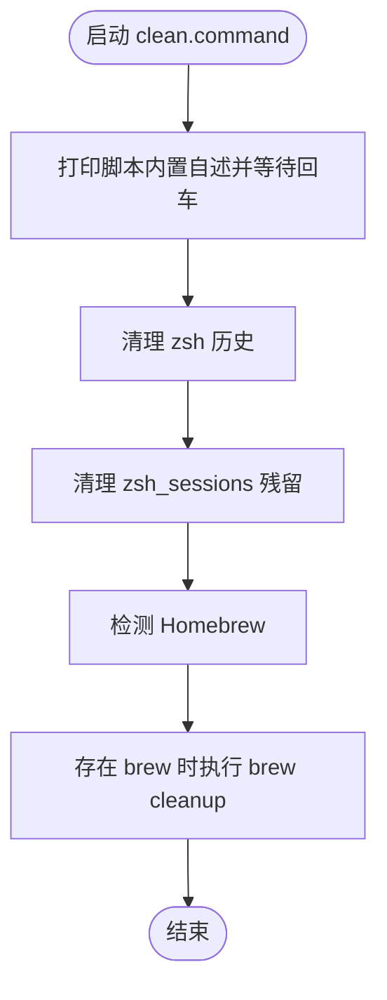

# clean.command


[toc]

## 🔥 <font id=前言>前言</font>

- 采用 Shell 脚本的原因：Shell 来自 [**macOS**](https://www.apple.com/macos/) 原生系统底层，虽然写法相对繁琐冗杂，但执行效率高，并且不需要额外介入 [**Ruby**](https://www.ruby-lang.org)、[**Python**](https://www.python.org) 等第三方运行环境，因此具备更好的移植性。


## 一、功能

清空 zsh 历史和 `zsh_sessions` 残留；检测到 Homebrew 时顺手执行 `brew cleanup`。

如果当前 Homebrew 开启 tap trust 策略，脚本会在清理前自动信任已安装的 `leoafarias/fvm` tap，避免 `brew cleanup` 反复输出 `Skipping fvm: tap formula is not trusted` 警告。

该脚本适合 `.command` 双击运行，也可以在终端中执行。启动后的说明展示、依赖检查和核心流程都写在脚本内部。

## 二、运行

```zsh
./clean.command
```

如果已经自行加入 `PATH`，也可以执行：

```zsh
clean
clean [参数...]
```

## 三、结构约定

运行时说明和核心流程已经写在 `clean.command` 内部，不依赖同级 `README.md`。

本 README 只用于源码浏览、维护说明和当前流程说明。

## 四、流程图



## 五、日志文件

运行日志默认写入 `/tmp`，文件名通常来自脚本名去掉扩展名：

```shell
/tmp/clean.log
```

<a id="🔚" href="#前言" style="font-size:17px; color:green; font-weight:bold;">我是有底线的➤点我回到首页</a>
