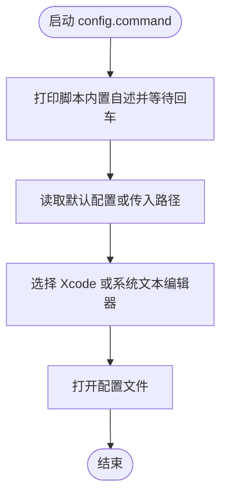

# config.command


[toc]

## 🔥 <font id=前言>前言</font>

- 采用 Shell 脚本的原因：Shell 来自 [**macOS**](https://www.apple.com/macos/) 原生系统底层，虽然写法相对繁琐冗杂，但执行效率高，并且不需要额外介入 [**Ruby**](https://www.ruby-lang.org)、[**Python**](https://www.python.org) 等第三方运行环境，因此具备更好的移植性。


## 一、功能

用 Xcode 或系统文本编辑器打开 `~/.zshrc`，也可以打开指定配置文件。

该脚本适合 `.command` 双击运行，也可以在终端中执行。启动后的说明展示、依赖检查和核心流程都写在脚本内部。

## 二、运行

```zsh
./config.command
```

如果已经自行加入 `PATH`，也可以执行：

```zsh
config
config [参数...]
```

## 三、结构约定

运行时说明和核心流程已经写在 `config.command` 内部，不依赖同级 `README.md`。

本 README 只用于源码浏览、维护说明和当前流程说明。

## 四、流程图



## 五、日志文件

运行日志默认写入 `/tmp`，文件名通常来自脚本名去掉扩展名：

```shell
/tmp/config.log
```

<a id="🔚" href="#前言" style="font-size:17px; color:green; font-weight:bold;">我是有底线的➤点我回到首页</a>
