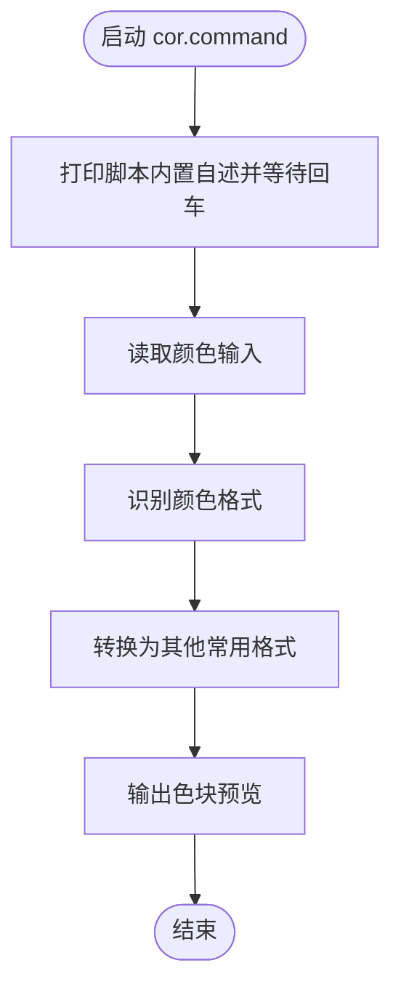

# cor.command

[toc]

## 一、功能

转换 HEX / RGB / RGBA / `0xAARRGGBB` 等颜色格式，并输出终端色块预览。

该脚本适合 `.command` 双击运行，也可以在终端中执行。启动后的说明展示、依赖检查和核心流程都写在脚本内部。

## 二、运行

```zsh
./cor.command
```

如果已经自行加入 PATH，也可以执行：

```zsh
cor
cor [参数...]
```

## 三、结构约定

运行时说明和核心流程已经写在 `cor.command` 内部，不依赖同级 `README.md`。

本 README 只用于源码浏览、维护说明和当前流程说明。

## 四、流程图


