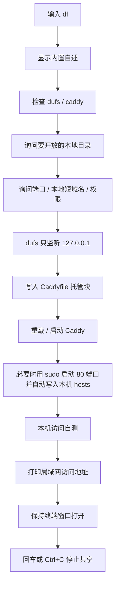

# `df.command`


[toc]

---

## 🔥 <font id=前言>前言</font> <a href="#🔚" style="font-size:17px; color:green;"><b>🔽</b></a>

- 采用 Shell 脚本的原因：Shell 来自 [**macOS**](https://www.apple.com/macos/) 原生系统底层，虽然写法相对繁琐冗杂，但执行效率高，并且不需要额外介入 [**Ruby**](https://www.ruby-lang.org)、[**Python**](https://www.python.org) 等第三方运行环境，因此具备更好的移植性。

`df.command` 是 JobsMacEnv 的局域网目录共享入口。

它会把一个本地目录交给 [**dufs**](https://github.com/sigoden/dufs) 提供文件服务，再自动写入 [**Caddy**](https://caddyserver.com/) 的 `Caddyfile`，让同一局域网里的其它电脑 / 手机可以直接用浏览器访问。默认使用 Caddy 的 `80` 端口，所以浏览器地址不用带端口。

> 注意：`df` 会和 macOS 原生 `$SYSTEM_BIN_DIR/df` 磁盘空间命令重名。需要查看磁盘空间时，请用 `$SYSTEM_BIN_DIR/df -h`。

## 一、适用场景 <a href="#前言" style="font-size:17px; color:green;"><b>🔼</b></a> <a href="#🔚" style="font-size:17px; color:green;"><b>🔽</b></a>

| 场景 | 说明 |
| --- | --- |
| 局域网临时传文件 | Mac 开一个目录，其它电脑浏览器下载 |
| 手机访问 Mac 文件 | 手机和 Mac 在同一 Wi-Fi 下直接访问 |
| 临时替代 FTP | 不需要 FTP 客户端，浏览器即可 |
| Caddy 统一入口 | `Caddyfile` 由脚本自动维护 |
| 本地短域名访问 | 默认使用 `jobsdocs.test` 这类短域名；脚本会自动写入本机 `$SYSTEM_CONFIG_DIR/hosts`。手机 / 其它电脑优先用 IP 或 Mac 的 `.local` 名称；自定义短域名需要路由器 / 局域网 DNS |

## 二、运行方式 <a href="#前言" style="font-size:17px; color:green;"><b>🔼</b></a> <a href="#🔚" style="font-size:17px; color:green;"><b>🔽</b></a>

- 最推荐的交互式运行：

  ```shell
  df
  ```

  直接输入 `df` 后会询问要开放的目录；直接回车就使用当前终端所在目录。

- 直接开放当前目录：

  ```shell
  df .
  ```

- 直接开放指定目录：

  ```shell
  df ../../../../JobsDocs
  ```

- 少问问题，全部使用默认值：

  ```shell
  df --yes
  ```

- 指定短域名前缀，脚本会自动补 `.test`：

  ```shell
  df --domain jobsdocs
  ```

- 指定 Caddy 对外端口：

  ```shell
  df --external-port 8099
  ```

- 不自动写入本机 hosts：

  ```shell
  df --no-hosts
  ```

- 需要上传 / 删除 / 编辑时才启用写模式：

  ```shell
  df --rw --auth 'admin:123456@/:rw'
  ```

## 三、交互流程 <a href="#前言" style="font-size:17px; color:green;"><b>🔼</b></a> <a href="#🔚" style="font-size:17px; color:green;"><b>🔽</b></a>

直接输入：

```shell
df
```

脚本会依次做这些事：

| 步骤 | 说明 |
| --- | --- |
| 显示内置自述 | 运行时不读取 `README.md`，直接显示脚本内置说明 |
| 询问目录 | 默认当前终端所在目录；可拖入目录、输入路径，或直接回车确认当前目录 |
| 询问端口 | 默认 Caddy 对外端口 `80`，浏览器不用带端口；dufs 内部端口 `5010` |
| 询问本地短域名 | 直接回车默认用 `目录名.test`；输入 `jobsdocs` 会自动变成 `jobsdocs.test`；禁止使用 `.cn` / `.com` 等公网真实后缀 |
| 询问权限 | 默认只读；如选择读写，会继续询问账号密码 |
| 写入 Caddyfile | 自动插入 Jobs 托管块，并先做备份 |
| 重载 Caddy | 让新配置生效 |
| 自动写本机 hosts | 选择短域名后，自动把 `127.0.0.1 短域名` 写入这台 Mac 的 `$SYSTEM_CONFIG_DIR/hosts` |
| 本机自测 | 自动测试 `127.0.0.1` 和短域名入口是否能访问 |
| 打印访问地址 | 明确告诉你本机 / 其它电脑浏览器应该输入什么 |

成功后会输出类似：

```text
访问方式汇总

1）IP 访问：不需要配置域名，最稳。
  http://192.168.31.66

2）本机浏览器短域名访问：脚本已处理本机 hosts。
  本机已自动写入：127.0.0.1 jobsdocs.test
  http://jobsdocs.test

3）其它同局域网电脑 / 手机短域名访问：其它设备也要能解析这个短域名。
  192.168.31.66 jobsdocs.test
  http://jobsdocs.test
```

其它电脑 / 手机如果没有配置局域网 DNS，就先输入 IP 地址这一行，或者尝试脚本输出的 Mac `.local` 地址。本机短域名由脚本自动配置；手机上的 `jobsdocs.test` 这种自定义短域名，必须在路由器 / AdGuard Home / Pi-hole / dnsmasq 里做局域网 DNS 映射。

> 不要使用 `.cn`、`.com`、`.net`、`.org`、`.io` 等公网真实后缀做局域网短域名。脚本默认统一使用 `.test`。

## 四、执行前检查 <a href="#前言" style="font-size:17px; color:green;"><b>🔼</b></a> <a href="#🔚" style="font-size:17px; color:green;"><b>🔽</b></a>

脚本会自动检查：

| 工具 | 用途 | 缺失时 |
| --- | --- | --- |
| [**Homebrew**](https://brew.sh/) | 安装 / 检测依赖 | 提示先安装 |
| [**dufs**](https://github.com/sigoden/dufs) | 本地文件服务 | 询问是否 `brew install dufs` |
| [**Caddy**](https://caddyserver.com/) | 局域网入口 / 反向代理 | 询问是否 `brew install caddy` |

默认端口：

| 端口 | 作用 |
| --- | --- |
| `80` | Caddy 对局域网暴露的端口，浏览器不用带端口 |
| `5010` | dufs 只监听 `127.0.0.1` 的内部端口 |

短域名默认规则：

| 输入 | 实际使用 |
| --- | --- |
| 直接回车 | 根据目录名生成，例如 `JobsDocs` → `jobsdocs.test` |
| `jobsdocs` | 自动补成 `jobsdocs.test` |
| `jobsdocs.test` | 直接使用 |
| `jobsdocs.cn` | 拒绝，公网真实后缀不用于局域网短域名 |
| `none` | 不使用短域名，只输出 IP 访问 |

本地短域名说明：

| 项 | 说明 |
| --- | --- |
| Caddy | 接收 `http://jobsdocs.test` / `http://192.168.x.x` 这类请求并反代到 dufs |
| 本机 `$SYSTEM_CONFIG_DIR/hosts` | 脚本自动写入 `127.0.0.1 jobsdocs.test`，用于这台 Mac 自己访问 |
| 其它设备 / 局域网 DNS | 这台 Mac 不能自动改手机；手机要用 `jobsdocs.test` 必须让路由器 / DNS 知道它指向这台 Mac |
| 访问地址 | 默认是 `http://jobsdocs.test`，不是 `https://`；只有改用 `--external-port 8099` 时才必须带 `:8099` |

## 五、流程图 <a href="#前言" style="font-size:17px; color:green;"><b>🔼</b></a> <a href="#🔚" style="font-size:17px; color:green;"><b>🔽</b></a>



## 六、风险说明 <a href="#前言" style="font-size:17px; color:green;"><b>🔼</b></a> <a href="#🔚" style="font-size:17px; color:green;"><b>🔽</b></a>

- 默认只读，适合临时下载。
- `--rw` 会允许上传 / 删除 / 编辑，必须谨慎使用。
- `--rw` 未配置 `--auth` 时，脚本会要求输入大写 `YES` 才继续。
- 脚本只面向局域网使用，不建议直接暴露公网。
- 共享期间不要关闭当前终端窗口。
- 退出时默认移除 `Caddyfile` 的 Jobs 托管块；需要保留可加 `--keep-caddy`。
- 选择短域名时会修改本机 `$SYSTEM_CONFIG_DIR/hosts`，脚本会先备份为 `$SYSTEM_CONFIG_DIR/hosts.backup.jobs-df.时间戳`。
- 默认使用 `80` 端口，macOS 会要求管理员权限来启动 / 重载 Caddy。

## 七、日志文件 <a href="#前言" style="font-size:17px; color:green;"><b>🔼</b></a> <a href="#🔚" style="font-size:17px; color:green;"><b>🔽</b></a>

| 日志 | 路径 |
| --- | --- |
| 主脚本日志 | `$TMPDIR/df.log` |
| dufs 日志 | `$TMPDIR/df.dufs.5010.log` |
| Caddy 校验日志 | `$TMPDIR/df.caddy.validate.log` |

## 八、常见问题 <a href="#前言" style="font-size:17px; color:green;"><b>🔼</b></a> <a href="#🔚" style="font-size:17px; color:green;"><b>🔽</b></a>

| 问题 | 处理 |
| --- | --- |
| 其它电脑打不开 | 确认在同一 Wi-Fi / 局域网；检查 Mac 防火墙；确认终端还开着 |
| 想看磁盘空间 | 使用 `$SYSTEM_BIN_DIR/df -h` |
| 想换端口 | 执行 `df --external-port 8099` |
| 本机短域名打不开 | 新版脚本会自动写入本机 `$SYSTEM_CONFIG_DIR/hosts` 并做自测；默认访问 `http://短域名`，不要带 `https://` |
| 手机短域名打不开 | 手机不能被 Mac 自动写 hosts；优先用 `http://Mac本地主机名.local` 或 `http://192.168.x.x`，自定义短域名要配路由器 / 局域网 DNS |
| 想保留 Caddy 配置 | 执行 `df --keep-caddy` |
| 想停止共享 | 回到运行 `df` 的终端窗口，按回车 |

<a id="🔚" href="#前言" style="font-size:17px; color:green; font-weight:bold;">我是有底线的➤点我回到首页</a>
