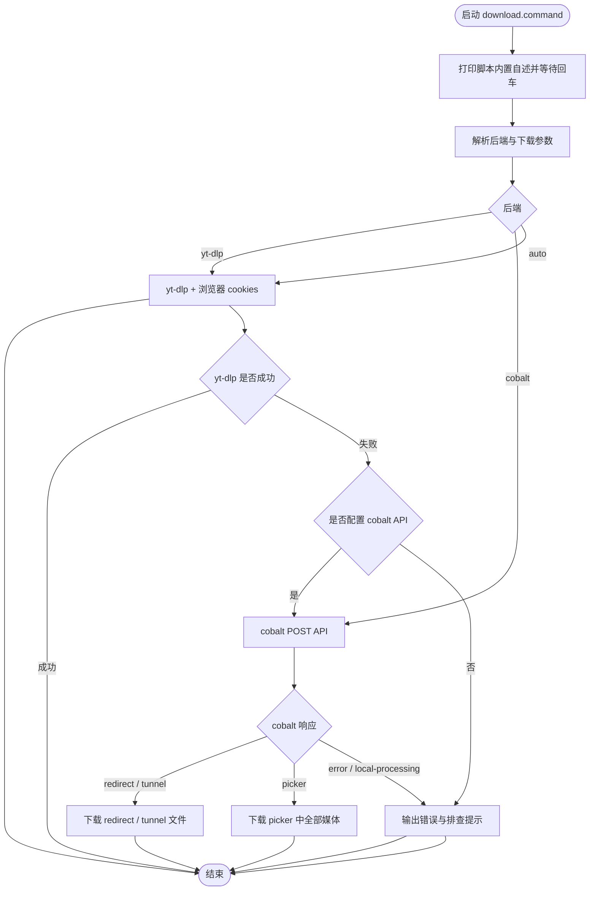

# download.command


[toc]

## 🔥 <font id=前言>前言</font>

- 采用 Shell 脚本的原因：Shell 来自 [**macOS**](https://www.apple.com/macos/) 原生系统底层，虽然写法相对繁琐冗杂，但执行效率高，并且不需要额外介入 [**Ruby**](https://www.ruby-lang.org)、[**Python**](https://www.python.org) 等第三方运行环境，因此具备更好的移植性。

## 一、功能 <a href="#前言" style="font-size:17px; color:green;"><b>🔼</b></a> <a href="#🔚" style="font-size:17px; color:green;"><b>🔽</b></a>

`download.command` 是本机媒体下载入口。

- 默认使用 [**yt-dlp**](https://github.com/yt-dlp/yt-dlp)，自动检测 [**macOS**](https://www.apple.com/macos/) 默认浏览器，并透传 `--cookies-from-browser`。
- 默认后端为 `auto`：先执行 `yt-dlp`；如果失败，并且已经配置 [**cobalt**](https://github.com/imputnet/cobalt) API，则自动切换到 cobalt 兜底。
- 支持 `--backend yt-dlp`、`--backend cobalt`、`--cobalt` 等显式后端选择。
- cobalt 后端通过 API 返回的 `redirect` / `tunnel` / `picker` 响应下载文件；`picker` 多图、多视频场景默认全部保存，减少交互卡壳。

## 二、运行 <a href="#前言" style="font-size:17px; color:green;"><b>🔼</b></a> <a href="#🔚" style="font-size:17px; color:green;"><b>🔽</b></a>

直接运行脚本：

```zsh
./download.command
```

如果已经加入 `PATH`，可以直接执行：

```zsh
download "https://www.youtube.com/shorts/xxxx?feature=share"
download --backend auto "https://example.com/video"
download --backend yt-dlp "https://example.com/video" -o "%(title)s.%(ext)s"
download --backend cobalt "https://example.com/video"
download --cobalt "https://example.com/video"
```

查看帮助：

```zsh
download --help
```

## 三、cobalt API <a href="#前言" style="font-size:17px; color:green;"><b>🔼</b></a> <a href="#🔚" style="font-size:17px; color:green;"><b>🔽</b></a>

[**cobalt**](https://github.com/imputnet/cobalt) 官方定位是媒体下载 API / Web 服务，不是 `yt-dlp` 这种单机 CLI。`download.command` 默认不调用公开托管 API，避免把不稳定或带防机器人策略的公开实例硬塞进本机命令。

推荐配置自建 cobalt 实例：

```zsh
export JOBS_DOWNLOAD_COBALT_API="https://your-cobalt-api.example/"
```

如果实例启用了 API Key：

```zsh
export JOBS_DOWNLOAD_COBALT_KEY="xxxxxxxx-xxxx-xxxx-xxxx-xxxxxxxxxxxx"
```

如果需要完整自定义鉴权头：

```zsh
export JOBS_DOWNLOAD_COBALT_AUTHORIZATION="Api-Key xxxxxxxx-xxxx-xxxx-xxxx-xxxxxxxxxxxx"
```

cobalt 下载参数：

```zsh
download --cobalt --audio "https://example.com/video"
download --cobalt --mute "https://example.com/video"
download --cobalt --cobalt-quality max "https://example.com/video"
download --cobalt --cobalt-audio-format best "https://example.com/video"
```

可用环境变量：

| 变量 | 用途 | 默认值 |
| ---- | ---- | ------ |
| `JOBS_DOWNLOAD_BACKEND` | 默认后端：`auto` / `yt-dlp` / `cobalt` | `auto` |
| `JOBS_DOWNLOAD_COBALT_API` | 自建 cobalt API 地址 | 空 |
| `JOBS_DOWNLOAD_COBALT_KEY` | cobalt `Api-Key` 鉴权值 | 空 |
| `JOBS_DOWNLOAD_COBALT_AUTHORIZATION` | 完整 `Authorization` 头 | 空 |
| `JOBS_DOWNLOAD_COBALT_MODE` | cobalt 下载模式：`auto` / `audio` / `mute` | `auto` |
| `JOBS_DOWNLOAD_COBALT_QUALITY` | cobalt 视频质量 | `max` |
| `JOBS_DOWNLOAD_COBALT_AUDIO_FORMAT` | cobalt 音频格式 | `best` |

## 四、流程图 <a href="#前言" style="font-size:17px; color:green;"><b>🔼</b></a> <a href="#🔚" style="font-size:17px; color:green;"><b>🔽</b></a>



## 五、依赖 <a href="#前言" style="font-size:17px; color:green;"><b>🔼</b></a> <a href="#🔚" style="font-size:17px; color:green;"><b>🔽</b></a>

基础下载依赖：

```zsh
brew install yt-dlp
```

cobalt 后端使用 [**macOS**](https://www.apple.com/macos/) 自带 `curl` 和 `plutil` 处理 API 请求与 JSON 响应，不额外要求 `jq`。

## 六、风险边界 <a href="#前言" style="font-size:17px; color:green;"><b>🔼</b></a> <a href="#🔚" style="font-size:17px; color:green;"><b>🔽</b></a>

- `download` 只负责下载公开或你有权访问的内容；请遵守目标网站条款和当地法律。
- `yt-dlp` 会读取浏览器 cookies，用于处理需要登录态的公开内容。
- cobalt fallback 只有在配置 API 后才会自动触发；官方公开实例不作为默认后端。
- cobalt `local-processing` 响应暂不在本脚本内接管 [**FFmpeg**](https://ffmpeg.org) 合并，遇到时会提示改回 `yt-dlp` 或调整 cobalt 实例配置。

## 七、日志文件 <a href="#前言" style="font-size:17px; color:green;"><b>🔼</b></a> <a href="#🔚" style="font-size:17px; color:green;"><b>🔽</b></a>

运行日志默认写入：

```shell
$TMPDIR/download.log
```

<a id="🔚" href="#前言" style="font-size:17px; color:green; font-weight:bold;">我是有底线的➤点我回到首页</a>
