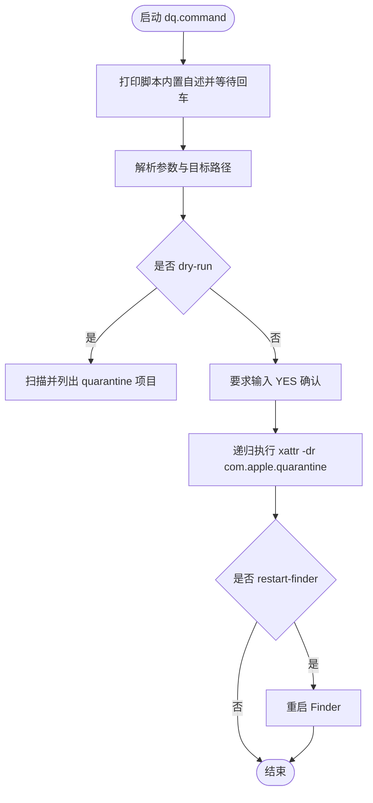

# dq.command

[toc]

## 一、功能

递归解除指定文件 / 目录上的 macOS `com.apple.quarantine` 隔离属性；不传路径时默认处理当前终端所在目录。

该脚本适合终端中执行，也可以作为 `.command` 双击运行。启动后的说明展示、危险确认和核心流程都写在脚本内部。

## 二、运行

```zsh
./dq.command
```

如果已经自行加入 PATH，也可以执行：

```zsh
dq
dq .
dq ~/Downloads
dq --dry-run
dq --yes
dq --restart-finder
```

## 三、交互规则

默认递归处理当前目录，并要求输入 `YES` 才会真正删除 quarantine 属性。`--dry-run` 只扫描并列出带 quarantine 属性的项目，不会修改文件；`--yes` 跳过确认，只建议在可信目录中使用。

`--restart-finder` 会在处理完成后重启 Finder，用于刷新 Finder / 默认打开方式缓存。

## 四、结构约定

运行时说明和核心流程已经写在 `dq.command` 内部，不依赖同级 `README.md`。

本 README 只用于源码浏览、维护说明和当前流程说明。

## 五、流程图


