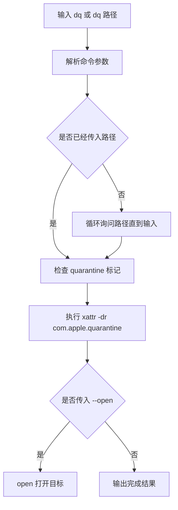

# dq.command

解决新装 App 无法打开、被系统建议移到废纸篓的问题；底层会清理传入路径上的 macOS quarantine 隔离标记。

## 一、用途

`dq` 是对下面命令的安全包装：

```zsh
xattr -dr com.apple.quarantine "目标路径"
```

它只处理你传入的路径，不会执行 `spctl --master-disable`，也不会全局关闭 Gatekeeper。

## 二、使用方式

```zsh
dq
dq ~/Downloads/Otty.dmg
dq "~/Downloads/Otty (1).dmg"
dq ~/Downloads/Otty\ \(1\).dmg
dq --open $APPLICATIONS_DIR/Otty.app
dq --dry-run ~/Downloads/Otty.dmg
```

直接输入 `dq` 时，脚本会询问文件路径；可以手动输入，也可以从 Finder 拖入文件、App 或目录后回车。没有输入内容时会继续询问，直到输入路径或按 `Ctrl+C` 取消。

参数说明：

| 参数 | 说明 |
| --- | --- |
| `--open` | 清理隔离标记后调用 `open` 打开目标 |
| `--dry-run` | 只检查并打印结果，不修改文件 |
| `-h` / `--help` | 显示帮助 |

## 三、流程



## 四、安全边界

- 只对明确传入的路径移除 `com.apple.quarantine`。
- 不提升权限，不请求 `sudo`。
- 不修改 macOS 全局安全策略。
- 只建议对来源可信、你主动下载的软件使用。

## 五、日志

```text
$TMPDIR/dq.log
```
