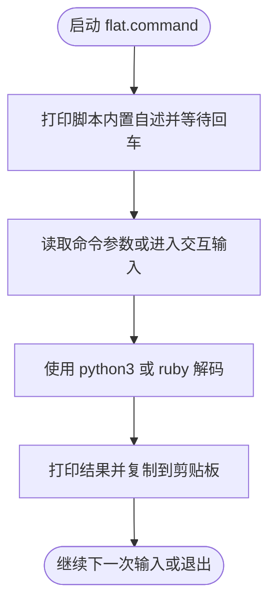

# flat.command

[toc]

## 一、功能

URL 百分号编码去乱码 / 解码工具；支持参数直接解码和交互输入，结果会自动复制到剪贴板。

该脚本适合 `.command` 双击运行，也可以在终端中执行。启动后的说明展示、依赖检查和核心流程都写在脚本内部。

## 二、运行

```zsh
./flat.command
```

如果已经自行加入 PATH，也可以执行：

```zsh
flat
flat [参数...]
flat "%E4%BD%A0%E5%A5%BD"
flat --plus "hello+world%21"
```

## 三、交互规则

`--plus` 会把 `+` 一并解析为空格，适合表单编码文本。`-h` / `--help` 只显示帮助，不进入解码流程。

## 四、结构约定

运行时说明和核心流程已经写在 `flat.command` 内部，不依赖同级 `README.md`。

本 README 只用于源码浏览、维护说明和当前流程说明。

## 五、流程图


