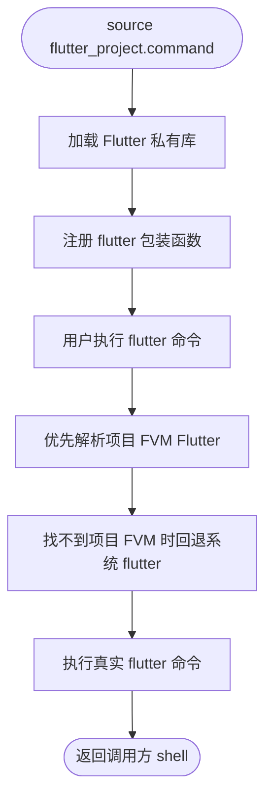

# flutter_project.command


[toc]

## 🔥 <font id=前言>前言</font>

- 采用 Shell 脚本的原因：Shell 来自 [**macOS**](https://www.apple.com/macos/) 原生系统底层，虽然写法相对繁琐冗杂，但执行效率高，并且不需要额外介入 [**Ruby**](https://www.ruby-lang.org)、[**Python**](https://www.python.org) 等第三方运行环境，因此具备更好的移植性。


## 一、功能

提供 Flutter 项目辅助命令模块，核心是重载 `flutter()`：优先使用项目内 FVM Flutter，否则回退系统 flutter。

该文件主要作为 JobsMacEnv 的 shell 函数模块 / 入口注册模块使用，通常由 shell 配置或上层脚本 `source` 加载。

## 二、运行

```zsh
source Scripts/flutter_project.command/flutter_project.command
```

## 三、交互规则

该文件是函数模块，应由 JobsMacEnv 加载；不要当作独立自动执行流程使用。

## 四、结构约定

该文件位于 `Scripts/flutter_project.command/flutter_project.command`。

同级 `README.md` 只用于源码浏览、维护说明和当前流程说明，不参与运行时加载。

## 五、流程图



## 六、日志文件

运行日志默认写入 `/tmp`，文件名通常来自脚本名去掉扩展名：

```shell
/tmp/flutter_project.log
```

<a id="🔚" href="#前言" style="font-size:17px; color:green; font-weight:bold;">我是有底线的➤点我回到首页</a>
