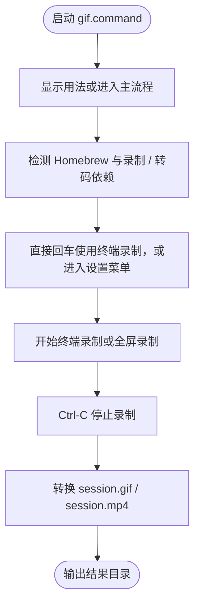

# gif.command

[toc]

## 一、功能

录制当前终端会话或整个屏幕，并在录制结束后转成高质量 GIF 和 MP4。

该脚本适合 `.command` 双击运行，也可以在终端中执行。启动后的说明展示、依赖检查和核心流程都写在脚本内部。

## 二、运行

```zsh
./gif.command
```

如果已经自行加入 PATH，也可以执行：

```zsh
gif
gif [参数...]
gif --repair <输出目录、session.cast 或 session.mov>
gif --help
```

## 三、交互规则

启动录制时直接回车会跳过设置菜单，默认使用当前终端录制；输入任意字符后回车进入设置菜单。录制过程中按 `Ctrl-C` 停止并转换结果。

## 四、结构约定

运行时说明和核心流程已经写在 `gif.command` 内部，不依赖同级 `README.md`。

本 README 只用于源码浏览、维护说明和当前流程说明。

## 五、流程图


