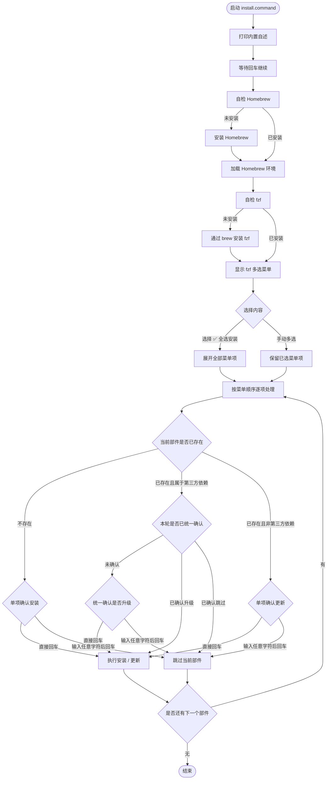
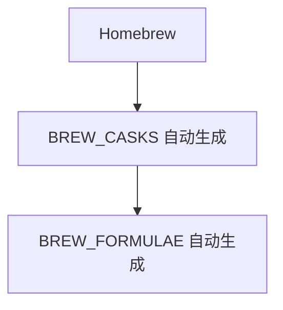
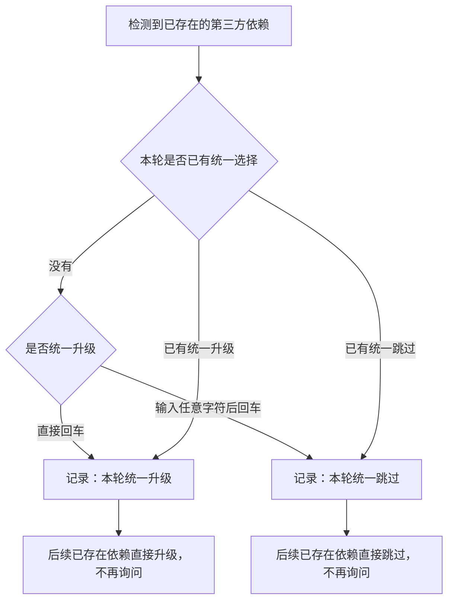

# install.command

[toc]

## 一、功能

安装和初始化常用 macOS 开发环境依赖。

该脚本适合 `.command` 双击运行，也可以在终端中执行。启动后会先打印内置自述，再进入 fzf 多选菜单。

注意：`install` 这个命令名与系统 `/usr/bin/install` 存在冲突风险，建议保留 `.command` 后缀或放在明确的工具目录中调用。

## 二、运行

```zsh
./install.command
```

如果已经自行加入 PATH，也可以执行：

```zsh
install.command
install.command [参数...]
```

## 三、Homebrew 第三方配置

脚本顶部已经集中放置 Homebrew 第三方配置区：

```zsh
readonly -a BREW_CASKS=(
  hammerspoon
  flutter
  trex
  vlc
)

readonly -a BREW_FORMULAE=(
  git-lfs
  gh
  nushell
  rbenv
  ruby
  node
  jenv
  openjdk
  openjdk@17
  fvm
  pnpm
  python
  python3
  fastlane
  mysql
  hugo
  yt-dlp
  ffmpeg
  go-task
  uv
  fzf
  lazygit
)
```

维护规则：

```text
brew cask：只在 BREW_CASKS 里写第三方名称
brew formula：只在 BREW_FORMULAE 里写第三方名称
```

不要在数组里写完整命令，例如不要写：

```zsh
brew install git-lfs
brew install --cask vlc
```

直接写名字即可：

```zsh
git-lfs
vlc
```

菜单项会根据这两个数组自动生成，执行时会自动拼出：

```zsh
brew install xxx
brew install --cask xxx
```

少数有特殊处理的 formula 已经在脚本内部适配：

```text
fvm：自动 brew tap leoafarias/fvm
go-task：自动 brew tap go-task/tap，并使用 go-task/tap/go-task 安装
rbenv：安装 / 更新后自动写入 rbenv 初始化配置
jenv：安装 / 更新后自动写入 jenv 初始化配置
openjdk / openjdk@17：安装 / 更新后输出 Java 配置提示
fzf：安装 / 更新后自动写入 fzf shell 配置
```

## 四、菜单顺序

fzf 菜单固定为按显示顺序从上到下排列。

当前菜单结构如下：

```text
✅ 全选安装
Xcode Command Line Tools
Xcode iOS 平台组件
Oh My Zsh
Homebrew
brew cask：由 BREW_CASKS 自动生成
brew formula：由 BREW_FORMULAE 自动生成
Rosetta 2
npm 全局包：quicktype
gem 包：cocoapods
Git LFS 初始化
JobsKits 仓库
手动下载页面
```

## 五、brew 相关顺序

brew 相关部分固定为：

```text
Homebrew
brew cask：...
brew formula：...
```

也就是先处理 Homebrew，再紧接着显示依托 Homebrew 安装的 cask 与 formula 依赖。

## 六、交互规则

启动菜单前会自检 Homebrew 与 fzf。缺少 fzf 时，会先通过 Homebrew 安装 fzf，保证菜单可以正常显示。

菜单内使用：

```text
Tab 多选
Enter 确认
```

选择 `✅ 全选安装` 后，会按菜单顺序依次处理所有部件。缺失依赖仍按部件单独确认安装；已存在的第三方依赖升级会统一确认一次，不再逐项询问。

已存在第三方依赖的统一升级范围：

```text
brew cask
brew formula
npm 全局包
gem 包
```

普通安装 / 更新步骤的确认逻辑：

```text
直接回车：执行安装 / 更新
输入任意字符后回车：跳过
```

## 七、结构约定

运行时打印的自述已经写死在 `install.command` 内部，不依赖同级 `README.md`。

本 README 只用于源码浏览、维护说明和当前流程说明。

## 八、流程图



brew 相关部件在菜单中的处理顺序如下：



第三方依赖已存在时的统一升级确认：


