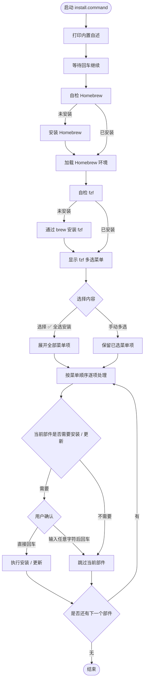
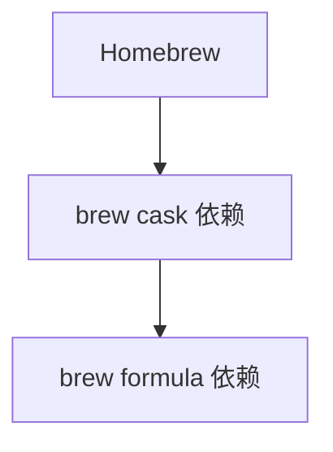

# install.command

[toc]

## 一、功能

安装和初始化常用 macOS 开发环境依赖。

该脚本适合 `.command` 双击运行，也可以在终端中执行。启动后会先打印内置自述，再进入 fzf 多选菜单。

注意：`install` 这个命令名与系统 `/usr/bin/install` 存在冲突风险，建议保留 `.command` 后缀或放在明确的工具目录中调用。

## 二、运行

```zsh
./install.command
```

如果已经自行加入 PATH，也可以执行：

```zsh
install.command
install.command [参数...]
```

## 三、菜单顺序

fzf 菜单固定为按显示顺序从上到下排列。

当前菜单顺序如下：

```text
✅ 全选安装
Xcode Command Line Tools
Xcode iOS 平台组件
Oh My Zsh
Homebrew
brew cask：hammerspoon
brew cask：flutter
brew cask：trex
brew cask：vlc
brew formula：git-lfs
brew formula：gh
brew formula：nushell
brew formula：rbenv
brew formula：ruby
brew formula：node
brew formula：jenv
brew formula：openjdk
brew formula：openjdk@17
brew formula：fvm
brew formula：pnpm
brew formula：python
brew formula：python3
brew formula：fastlane
brew formula：mysql
brew formula：hugo
brew formula：yt-dlp
brew formula：ffmpeg
brew formula：go-task
brew formula：uv
brew formula：fzf
brew formula：lazygit
Rosetta 2
npm 全局包：quicktype
gem 包：cocoapods
Git LFS 初始化
JobsKits 仓库
手动下载页面
```

## 四、brew 相关顺序

brew 相关部分固定为：

```text
Homebrew
brew cask：...
brew formula：...
```

也就是先处理 Homebrew，再紧接着显示依托 Homebrew 安装的 cask 与 formula 依赖。

## 五、交互规则

启动菜单前会自检 Homebrew 与 fzf。缺少 fzf 时，会先通过 Homebrew 安装 fzf，保证菜单可以正常显示。

菜单内使用：

```text
Tab 多选
Enter 确认
```

选择 `✅ 全选安装` 后，会按菜单顺序依次处理所有部件，但每个部件真正安装 / 更新前仍需要单独回车确认。

普通安装 / 更新步骤的确认逻辑：

```text
直接回车：执行安装 / 更新
输入任意字符后回车：跳过
```

## 六、结构约定

运行时打印的自述已经写死在 `install.command` 内部，不依赖同级 `README.md`。

本 README 只用于源码浏览、维护说明和当前流程说明。

## 七、流程图



brew 相关部件在菜单中的处理顺序如下：


