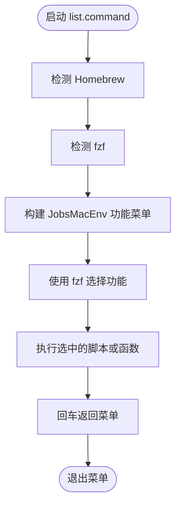
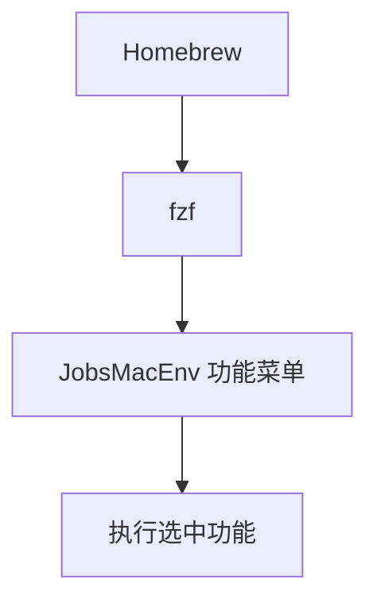

# list.command

[toc]

## 一、功能

打开 JobsMacEnv 功能菜单，集中展示并执行各个 `.command` 兄弟脚本。

该脚本适合 `.command` 双击运行，也可以在终端中执行。启动后的说明展示、依赖检查和核心流程都写在脚本内部。

## 二、运行

```zsh
./list.command
```

如果已经自行加入 PATH，也可以执行：

```zsh
list
list [参数...]
```

## 三、菜单顺序

当前菜单按显示顺序从上到下排列：

```text
文件校验：m5c
去乱码：flat
翻译：trs
录制 / GIF：gif
iOS 模拟器：simios
本地 Pod 自检：pods
终端清理：clean
目录共享：df
颜色转换：cor
URL 解码：decode
时间戳：ts
格式转换：to
转 MP4：mp4
转 MOV：mov
转 WebM：webm
转 MKV：mkv
转 AVI：avi
转 M4V：m4v
转 MP3：mp3
转 M4A：m4a
转 AAC：aac
转 WAV：wav
转 FLAC：flac
转 OGG：ogg
转 OPUS：opus
转 GIF：to gif
媒体下载：download
环境安装：install
环境更新：update
Shell 切换：shell
跳转路径：zz
执行文件：x
重载配置：save
重启 Shell：rb
打开 bash 配置：a
打开 zsh 配置：b
打开模拟器：i
Flutter：flutter_project.command
修复 FVM：fixfvm
Flutter 检查：check1
Flutter Doctor：check
项目清理：c
打开项目：d
构建检查：buildCheck
构建 APK：apk
构建 IPA：ipa
项目配置：config
退出菜单：quit
```

## 四、交互规则

菜单优先使用 Homebrew 安装的 fzf。缺少 Homebrew 或 fzf 时，会按普通工具流程询问是否安装；无法进入 fzf 时退回文本清单。`list` 这个入口名称很通用，存在与系统或第三方命令冲突的风险。

## 五、结构约定

运行时说明和核心流程已经写在 `list.command` 内部，不依赖同级 `README.md`。

本 README 只用于源码浏览、维护说明和当前流程说明。

## 六、流程图



菜单依赖处理顺序：




## 附：媒体转换入口

`list` 菜单已拆分展示媒体转换快捷入口：`to`、`mp4`、`mov`、`webm`、`mkv`、`avi`、`m4v`、`mp3`、`m4a`、`aac`、`wav`、`flac`、`ogg`、`opus`、`to gif`。

这些菜单项全部复用 `to.command`，没有复制业务逻辑。选择 `mp4` 时等价于执行：

```zsh
to mp4
```

进入后继续拖入或输入源文件路径，再按提示输入输出文件名。`gif` 仍保留为录制入口，GIF 转换在菜单中显示为 `to gif`。
