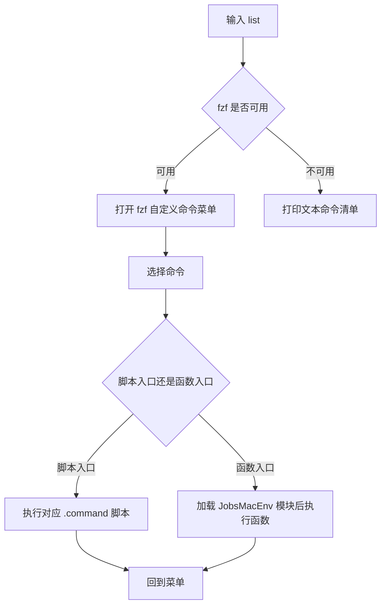

# list.command

JobsMacEnv 自定义命令菜单入口。

运行：

```bash
list
```

运行后不再打印长篇自述，也不再要求先按回车确认，而是直接进入 `fzf` 菜单。

如果 `fzf` 不可用，会退化为文本清单，直接列出所有自定义命令和含义。

## 当前展示的自定义命令

| 命令 | 含义 |
| --- | --- |
| `m5c` | 比较两个文件 MD5，判断字节内容是否一致 |
| `flat` | URL 百分号编码解码，并复制结果到剪贴板 |
| `trs` | macOS 原生翻译入口 |
| `gif` | 终端 / 全屏录制并导出 GIF / MP4 |
| `jdk17` | 检测并安装 JDK 17 |
| `simios` | 检测 Xcode 环境并下载 / 补齐 iOS Simulator Runtime |
| `cor` | 颜色格式转换器，支持 HEX / RGB / RGBA / 0xAARRGGBB |
| `decode` | 交互式 URL Decode，并自动复制到剪贴板 |
| `ts` | Unix 时间戳转换，支持秒 / 毫秒 / 微秒 / 纳秒 |
| `download` | 调用 yt-dlp，自动使用默认浏览器 cookies 下载媒体 |
| `install` | 新系统开发环境配置 / 依赖安装入口 |
| `update` | JobsMacEnv 更新菜单，批量更新开发工具链 |
| `shell` | 扫描并切换可用 shell |
| `zz` | 解析 Finder 替身 / 软链接 / 文件路径并 cd 到真实目录 |
| `x` | 给拖入的脚本 chmod +x 并执行 |
| `save` | 重新加载 bash / zsh 常见配置文件 |
| `rb` | 重启当前登录 shell；建议直接在终端输入 rb |
| `a` | 打开 ~/.bash_profile |
| `b` | 打开 ~/.zshrc |
| `i` | 打开 iOS Simulator |
| `flutter` | 优先使用项目 FVM Flutter，否则回退系统 flutter |
| `fixfvm` | 修复 / 检查 Flutter FVM 环境 |
| `check1` | 执行 Flutter 项目基础检查 |
| `check` | 执行项目相关检查 / flutter doctor |
| `c` | Flutter 项目 clean / 依赖刷新 |
| `d` | 打开当前配置的 Flutter 项目目录 |
| `buildCheck` | Flutter 构建前检查 |
| `apk` | 构建 Android APK |
| `ipa` | 构建 iOS IPA |
| `config` | 打印 / 打开当前 Flutter 项目配置 |

## 流程图



> 说明：脚本运行时展示逻辑已内置在 `.command` 脚本中，不读取本 README.md；本文件仅用于仓库/文件夹阅读。
