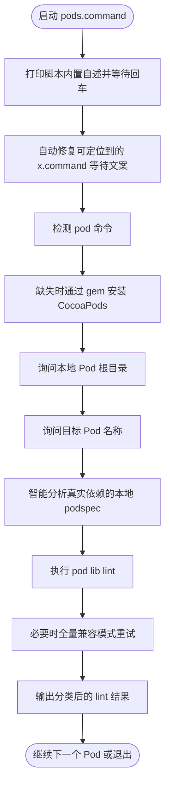

# pods.command

[toc]

## 一、功能

检查某个本地 CocoaPods Pod 是否能在自己的 podspec 环境下独立编译并通过 `pod lib lint`。

该脚本适合 `.command` 双击运行，也可以在终端中执行。启动后的说明展示、依赖检查和核心流程都写在脚本内部。

## 二、运行

```zsh
./pods.command
```

如果已经自行加入 PATH，也可以执行：

```zsh
pods
pods [参数...]
```

## 三、交互规则

会记住上一次输入的本地 Pod 根目录；下次回车直接沿用。单个 Pod 自检结束后，回车继续检查下一个 Pod，输入 `r` 更换根目录，输入 `q` 退出。

## 四、结构约定

运行时说明和核心流程已经写在 `pods.command` 内部，不依赖同级 `README.md`。

本 README 只用于源码浏览、维护说明和当前流程说明。

## 五、流程图


