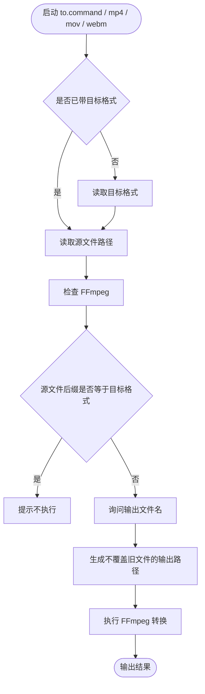

# to.command


[toc]

---

## 🔥 <font id=前言>前言</font> <a href="#🔚" style="font-size:17px; color:green;"><b>🔽</b></a>

- 采用 Shell 脚本的原因：Shell 来自 [**macOS**](https://www.apple.com/macos/) 原生系统底层，虽然写法相对繁琐冗杂，但执行效率高，并且不需要额外介入 [**Ruby**](https://www.ruby-lang.org)、[**Python**](https://www.python.org) 等第三方运行环境，因此具备更好的移植性。

`to.command` 是基于 [**FFmpeg**](https://ffmpeg.org/) 的通用媒体格式转换入口。

它只维护一个真实脚本，但可以通过 `to mp4 文件`、`mp4 文件`、`mov 文件`、`webm 文件`、`mp3 文件` 这类短命令调用，避免为每一种格式复制一份脚本。

## 一、适用场景 <a href="#前言" style="font-size:17px; color:green;"><b>🔼</b></a> <a href="#🔚" style="font-size:17px; color:green;"><b>🔽</b></a>

| 场景 | 推荐命令 |
| --- | --- |
| `webm` 转 `mp4` | `mp4 文件.webm` |
| 视频转 `mov` | `mov 文件.webm` |
| 视频转 `webm` | `webm 文件.mp4` |
| 视频提取 `mp3` | `mp3 文件.mp4` |
| 通用写法 | `to 目标格式 文件` |
| 生成 `gif` | `to gif 文件` |

> `gif` 在 JobsMacEnv 里已经是终端 / 屏幕录制入口，所以本工具不抢占 `gif` 短命令。需要转换 GIF 时使用 `to gif 文件`。

## 二、运行方式 <a href="#前言" style="font-size:17px; color:green;"><b>🔼</b></a> <a href="#🔚" style="font-size:17px; color:green;"><b>🔽</b></a>

### 2.1、终端短命令

```zsh
mp4 /Users/jobs/Desktop/input.webm
```

也可以先只输入目标格式，再回车拖入文件：

```zsh
mp4
```

脚本会提示：

```text
👉 请拖入或输入源文件路径；多个文件可连续拖入后回车，输入 q 取消：
```

这时从 Finder 把文件拖进终端即可。脚本会自动还原 macOS 拖入路径里的反斜杠转义，例如空格、中文、括号、方括号。

拿到源文件后会继续提示：

```text
👉 请输入输出文件名，不带 .mp4；直接回车沿用原文件名：
```

直接回车会沿用源文件名，例如：

```text
input.mp4
```

输入：

```text
goodbye-happiness
```

会输出：

```text
goodbye-happiness.mp4
```

### 2.2、通用命令

```zsh
to mp4 /Users/jobs/Desktop/input.webm
```

也可以一次传入多个文件：

```zsh
mp4 ~/Desktop/a.webm ~/Desktop/b.webm ~/Desktop/c.mov
```

脚本会逐个询问输出文件名。

### 2.3、通过 `list` 菜单执行

执行：

```zsh
list
```

在 [**fzf**](https://github.com/junegunn/fzf) 菜单里可以直接选择 `mp4`、`mov`、`webm`、`mp3` 等格式入口。

这些入口全部回到 `to.command`，例如选择 `mp4` 等价于：

```zsh
to mp4
```

随后脚本会要求拖入或输入源文件路径。

### 2.4、双击 `.command`

双击 `to.command` 时，会先展示本 `README.md`，按回车后进入交互模式：

1. 输入目标格式，例如 `mp4`。
2. 拖入或输入源文件路径。
3. 输入输出文件名；直接回车沿用原文件名。

## 三、执行前检查 <a href="#前言" style="font-size:17px; color:green;"><b>🔼</b></a> <a href="#🔚" style="font-size:17px; color:green;"><b>🔽</b></a>

脚本会检查 [**FFmpeg**](https://ffmpeg.org/) 是否可用。

- 如果已安装：直接执行转换。
- 如果未安装，但检测到 [**Homebrew**](https://brew.sh/)：会询问是否执行 `brew install ffmpeg`。
- 如果 [**Homebrew**](https://brew.sh/) 也不存在：脚本停止，并提示手动安装命令。

普通安装动作遵循 Jobs 交互规则：

```text
直接回车跳过；输入任意字符后回车执行
```

## 四、脚本执行命令 <a href="#前言" style="font-size:17px; color:green;"><b>🔼</b></a> <a href="#🔚" style="font-size:17px; color:green;"><b>🔽</b></a>

| 命令 | 说明 |
| --- | --- |
| `to mp4 文件` | 通用写法，转换为 `mp4` |
| `mp4 文件` | 快捷写法，转换为 `mp4` |
| `mov 文件` | 快捷写法，转换为 `mov` |
| `webm 文件` | 快捷写法，转换为 `webm` |
| `mkv 文件` | 快捷写法，转换为 `mkv` |
| `avi 文件` | 快捷写法，转换为 `avi` |
| `m4v 文件` | 快捷写法，转换为 `m4v` |
| `mp3 文件` | 提取或转换为 `mp3` |
| `m4a 文件` | 提取或转换为 `m4a` |
| `aac 文件` | 提取或转换为 `aac` |
| `wav 文件` | 提取或转换为 `wav` |
| `flac 文件` | 提取或转换为 `flac` |
| `ogg 文件` | 提取或转换为 `ogg` |
| `opus 文件` | 提取或转换为 `opus` |
| `to gif 文件` | 转换为 `gif`，不占用 `gif` 录制命令 |

## 五、流程图 <a href="#前言" style="font-size:17px; color:green;"><b>🔼</b></a> <a href="#🔚" style="font-size:17px; color:green;"><b>🔽</b></a>



## 六、日志文件 <a href="#前言" style="font-size:17px; color:green;"><b>🔼</b></a> <a href="#🔚" style="font-size:17px; color:green;"><b>🔽</b></a>

日志会写入 `/tmp/命令名.log`。

常见示例：

```text
/tmp/to.log
/tmp/mp4.log
/tmp/mov.log
```

## 七、风险说明 <a href="#前言" style="font-size:17px; color:green;"><b>🔼</b></a> <a href="#🔚" style="font-size:17px; color:green;"><b>🔽</b></a>

- 不覆盖已有文件；如果目标文件已存在，会自动追加 `_1`、`_2`。
- 输入格式和输出格式相同会直接停止，不做无意义转换。
- 只输入 `mp4`、`mov`、`webm` 等快捷命令时，会进入源文件路径交互输入。
- 交互输入源文件时，支持 Finder 拖入产生的 `\ `、`\[`、`\]` 等转义路径。
- 交互输入源文件时，输入 `q` / `quit` / `exit` 可以取消。
- 转换失败时，会清理本次生成的半成品输出文件。
- 脚本不会删除源文件。

## 八、未执行声明 <a href="#前言" style="font-size:17px; color:green;"><b>🔼</b></a> <a href="#🔚" style="font-size:17px; color:green;"><b>🔽</b></a>

当前文档和脚本只做静态语法检查。由于运行环境不是用户本机 macOS，未实际执行视频转码。

<a id="🔚" href="#前言" style="font-size:17px; color:green; font-weight:bold;">我是有底线的➤点我回到首页</a>
