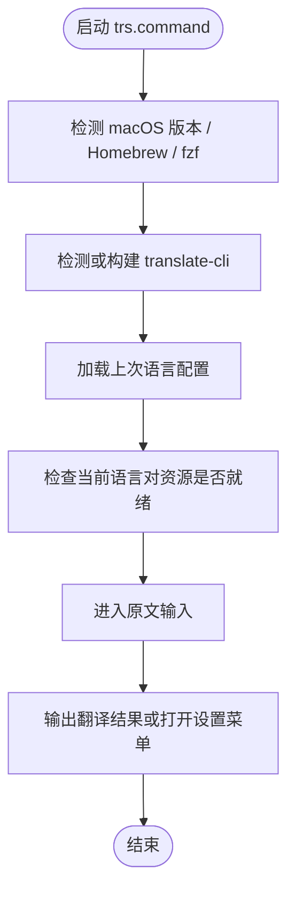

# trs.command

[toc]

## 一、功能

基于 macOS 原生 Translation Service 的终端翻译入口。

该脚本适合 `.command` 双击运行，也可以在终端中执行。启动后的说明展示、依赖检查和核心流程都写在脚本内部。

## 二、运行

```zsh
./trs.command
```

如果已经自行加入 PATH，也可以执行：

```zsh
trs
trs [参数...]
```

## 三、交互规则

启动后直接进入“原文 >”输入。直接输入原文并回车会立即翻译；输入单个空格后回车会打开设置菜单；`Ctrl-C` 退出。设置菜单用于切换方向、切换对方语言、打开 Translation Languages 设置或查看帮助。

## 四、结构约定

运行时说明和核心流程已经写在 `trs.command` 内部，不依赖同级 `README.md`。

本 README 只用于源码浏览、维护说明和当前流程说明。

## 五、流程图


