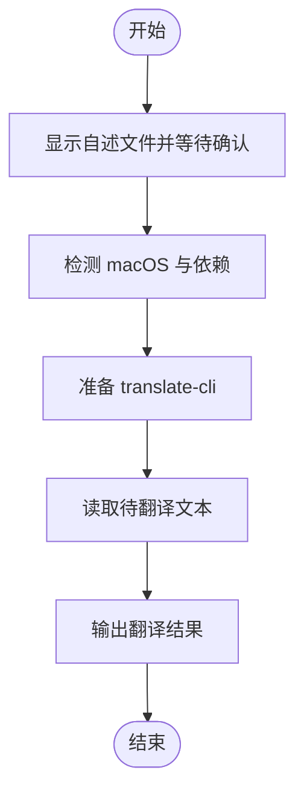

# **MacOS** JobsMacEnv - **macOS 原生翻译命令**

[toc]

<p align="left">
  <a></a>
  <a></a>
  <a></a>
</p>


## 一、🔥 <font id=前言>前言</font>

> 当前总行数：

* 🔧 **工欲善其事必先利其器**

* 🌋 **站在巨人的肩膀上，才能看得更远**

* ✝️ **面向信仰编程**

* 本文是 `trs.command` 的脚本自述文件。

* 基于 macOS translate-cli 能力提供终端翻译入口。

* 双击 `.command` 脚本运行时，会先显示自述文件并等待用户按回车，避免误操作。

## 二、🎯 项目白皮书 <a href="#前言" style="font-size:17px; color:green;"><b>🔼</b></a> <a href="#🔚" style="font-size:17px; color:green;"><b>🔽</b></a>

脚本定位：

* 脚本文件：`trs.command`
* 所属目录：`Scripts/trs.command/`
* 推荐入口：`trs`
* 日志策略：可执行脚本默认写入 `/tmp/脚本名.log`，函数模块由调用方统一管理日志。

## 三、🧭 脚本执行流程 <a href="#前言" style="font-size:17px; color:green;"><b>🔼</b></a> <a href="#🔚" style="font-size:17px; color:green;"><b>🔽</b></a>



## 四、🧩 功能清单 <a href="#前言" style="font-size:17px; color:green;"><b>🔼</b></a> <a href="#🔚" style="font-size:17px; color:green;"><b>🔽</b></a>

### 1、显示自述并等待确认

显示自述并等待确认。

### 2、检测 macOS 与依赖

检测 macOS 与依赖。

### 3、准备 translate-cli

准备 translate-cli。

### 4、读取待翻译文本

读取待翻译文本。

### 5、输出翻译结果

输出翻译结果。

## 五、🚀 使用方式 <a href="#前言" style="font-size:17px; color:green;"><b>🔼</b></a> <a href="#🔚" style="font-size:17px; color:green;"><b>🔽</b></a>

### 1、双击执行

在 Finder 中双击：

```shell
Scripts/trs.command/trs.command
```

### 2、终端执行

```shell
"Scripts/trs.command/trs.command"
```

已完成 JobsMacEnv 安装后，推荐入口：

```shell
trs
```

## 六、⚠️ 常见问题 <a href="#前言" style="font-size:17px; color:green;"><b>🔼</b></a> <a href="#🔚" style="font-size:17px; color:green;"><b>🔽</b></a>

### 1、为什么要先显示自述文件？

为了防止双击误触后直接修改环境、安装依赖或执行耗时任务。

### 2、为什么每个脚本都单独放一个同名文件夹？

这样可以把脚本、自述文件和未来扩展资源放在同一处，避免 Scripts 目录长期失控。

## 七、✅ 总结 <a href="#前言" style="font-size:17px; color:green;"><b>🔼</b></a> <a href="#🔚" style="font-size:17px; color:green;"><b>🔽</b></a>

`trs.command` 采用独立目录管理，便于阅读、维护、迁移和长期扩展。

<a id="🔚" href="#前言" style="font-size:17px; color:green; font-weight:bold;">我是有底线的➤点我回到首页</a>

> 说明：脚本运行时展示的自述已内置在 `.command` 脚本中，不读取本 README.md；本文件仅用于仓库/文件夹阅读。
