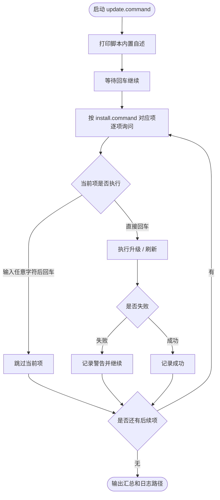
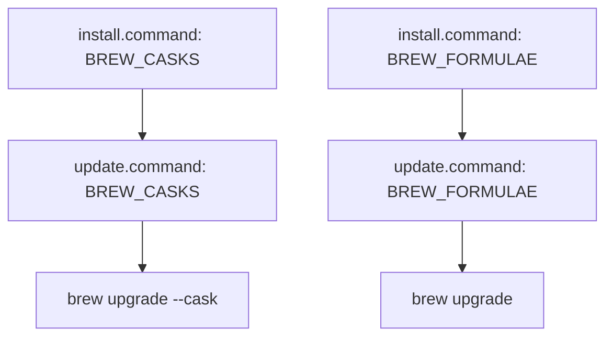

# `update.command`


[toc]

---

## 🔥 <font id=前言>前言</font> <a href="#🔚" style="font-size:17px; color:green;"><b>🔽</b></a>

`update.command` 用于升级和维护 `install.command` 已安装 / 初始化过的 MacOS 开发环境。

核心原则：

```text
install.command 安装的，都应该在 update.command 里面体现，并提供升级 / 刷新入口。
```

该脚本适合 `.command` 双击运行，也可以在终端中执行。启动后会先显示脚本内置自述，再按照更新顺序逐项询问。

## 一、运行方式 <a href="#前言" style="font-size:17px; color:green;"><b>🔼</b></a> <a href="#🔚" style="font-size:17px; color:green;"><b>🔽</b></a>

```zsh
./update.command
```

如果已经自行加入 `PATH`，也可以执行：

```zsh
update.command
update.command [参数...]
```

## 二、交互规则 <a href="#前言" style="font-size:17px; color:green;"><b>🔼</b></a> <a href="#🔚" style="font-size:17px; color:green;"><b>🔽</b></a>

`update` 本身就是升级入口，所以普通更新项采用：

```text
直接回车：执行升级 / 刷新
输入任意字符后回车：跳过当前项
```

单个更新项失败不会阻断后续更新项。

工具不存在时，`update.command` 默认只提示，不静默安装。需要补装请回到 `install.command`。

## 三、与 `install.command` 的对应关系 <a href="#前言" style="font-size:17px; color:green;"><b>🔼</b></a> <a href="#🔚" style="font-size:17px; color:green;"><b>🔽</b></a>

当前 `update.command` 已对齐 `install.command` 的这些安装 / 初始化项，并且按 `update.command` 实际询问顺序排列：

- [Xcode **C**ommand **L**ine **T**ools](https://developer.apple.com/xcode/resources/) / [`softwareupdate`](https://support.apple.com/guide/terminal/install-system-software-updates-apdc2ebf20d5/mac)
  - 对应更新：检查 CLT、接受 Xcode License、执行 `softwareupdate --install --all`
- [**Xcode**](https://developer.apple.com/xcode/) iOS 平台组件
  - 对应更新：清理 Xcode / CoreSimulator 缓存，执行 `xcodebuild -downloadPlatform iOS -verbose`
- [**Oh My Zsh**](https://ohmyz.sh/)
  - 对应更新：执行 `~/.oh-my-zsh/tools/upgrade.sh`
- [**Homebrew**](https://brew.sh/)
  - 对应更新：执行 `brew update`、`brew upgrade`、`brew upgrade --cask`、`brew cleanup`、`brew doctor`
  - `brew cask`：`BREW_CASKS` 自动生成
  - `brew formula`：`BREW_FORMULAE` 自动生成
- [**Rosetta 2**](https://support.apple.com/en-us/102527)
  - 对应更新：检查安装状态；Rosetta 2 通常跟随 MacOS 系统更新维护
- [**FVM**](https://fvm.app/) / [**Flutter**](https://flutter.dev/)
  - 对应更新：升级 FVM、执行 `flutter upgrade`、执行 `flutter doctor -v`
- [**Node.js**](https://nodejs.org/) / [**Corepack**](https://nodejs.org/api/corepack.html) / [**npm**](https://www.npmjs.com/) / [**pnpm**](https://pnpm.io/)
  - 对应更新：维护 Node LTS、启用 `corepack`、升级 `npm`
- `npm` 全局包：[**quicktype**](https://quicktype.io/)
  - 对应更新：执行 `npm update -g quicktype`
- `npm` 全局包：[**OpenCLI**](https://www.npmjs.com/package/@jackwener/opencli)
  - 对应更新：确认 Node.js 版本，执行 `npm install -g @jackwener/opencli@latest`
- [**Ruby**](https://www.ruby-lang.org/) / [**RubyGems**](https://rubygems.org/) / [**rbenv**](https://github.com/rbenv/rbenv)
  - 对应更新：刷新 `rbenv` 初始化配置，执行 `gem update --system`、`gem update`
- `gem` 包：[**CocoaPods**](https://cocoapods.org/)
  - 对应更新：执行 `gem update cocoapods`、`pod repo update`
- [**Python**](https://www.python.org/) / [**pip**](https://pip.pypa.io/) / [**uv**](https://docs.astral.sh/uv/)
  - 对应更新：执行 `pyenv update`、`pipx upgrade-all`、`python3 -m pip install --upgrade pip`
- [**Dart**](https://dart.dev/) `pub` 缓存
  - 对应更新：执行 `dart pub global list`、`dart pub cache repair`
- [**Git LFS**](https://git-lfs.com/) 初始化
  - 对应更新：执行 `git lfs install`，刷新大文件相关 Git 参数
- [**JobsKits**](https://github.com/JobsKits) 仓库
  - 对应更新：`JobsSoftware.MacOS`、`JobsMacEnvVarConfig` 执行 `git pull --ff-only`
- 手动下载 / 更新页面
  - [**Visual Studio Code**](https://code.visualstudio.com/)
  - [**Android Studio**](https://developer.android.com/studio)
  - [**Python Downloads**](https://www.python.org/downloads/)

## 四、Homebrew 第三方配置 <a href="#前言" style="font-size:17px; color:green;"><b>🔼</b></a> <a href="#🔚" style="font-size:17px; color:green;"><b>🔽</b></a>

`update.command` 内部保留与 `install.command` 同源的数组。

### 4.1、`brew cask`

```zsh
readonly -a BREW_CASKS=(
  hammerspoon
  flutter
  trex
  vlc
)
```

### 4.2、`brew formula`

```zsh
readonly -a BREW_FORMULAE=(
  git-lfs
  gh
  codex
  nushell
  rbenv
  ruby
  node
  jenv
  openjdk
  openjdk@17
  fvm
  pnpm
  python
  python3
  fastlane
  mysql
  hugo
  yt-dlp
  ffmpeg
  go-task
  uv
  fzf
  lazygit
  onlyoffice
  dufs
)
```

维护规则：

```text
install.command 增加 brew cask / formula 后，update.command 的同名数组必须同步增加。
```

少数特殊 `formula` 的更新后置动作已经适配：

- `fvm`：自动确认 `leoafarias/fvm` tap
- `go-task`：自动确认 `go-task/tap`，并使用 `go-task/tap/go-task` 升级
- `rbenv`：升级后刷新 `rbenv` 初始化配置
- `jenv`：升级后刷新 `jenv` 初始化配置
- `openjdk` / `openjdk@17`：升级后输出 Java 配置提示
- `fzf`：升级后刷新 `fzf` shell 配置

## 五、更新顺序总览 <a href="#前言" style="font-size:17px; color:green;"><b>🔼</b></a> <a href="#🔚" style="font-size:17px; color:green;"><b>🔽</b></a>

`update.command` 当前按以下顺序逐项询问：

1. Xcode **C**ommand **L**ine **T**ools / `softwareupdate`
2. [**Xcode**](https://developer.apple.com/xcode/) iOS 平台组件
3. [**Oh My Zsh**](https://ohmyz.sh/)
4. [**Homebrew**](https://brew.sh/)
5. `brew cask` 批量升级
6. `brew formula` 批量升级
7. [**Rosetta 2**](https://support.apple.com/en-us/102527) 状态检查
8. [**FVM**](https://fvm.app/) / [**Flutter**](https://flutter.dev/)
9. [**Node.js**](https://nodejs.org/) / `corepack` / `npm`
10. `npm` 全局包：[**quicktype**](https://quicktype.io/)
11. `npm` 全局包：[**OpenCLI**](https://www.npmjs.com/package/@jackwener/opencli)
12. [**Ruby**](https://www.ruby-lang.org/) / [**RubyGems**](https://rubygems.org/)
13. [**CocoaPods**](https://cocoapods.org/)
14. [**Python**](https://www.python.org/) / `pip`
15. [**Dart**](https://dart.dev/) `pub` 缓存
16. [**Git LFS**](https://git-lfs.com/) 初始化刷新
17. [**JobsKits**](https://github.com/JobsKits) 仓库
18. 手动下载 / 更新页面

## 六、风险说明 <a href="#前言" style="font-size:17px; color:green;"><b>🔼</b></a> <a href="#🔚" style="font-size:17px; color:green;"><b>🔽</b></a>

以下步骤可能耗时较长或触发系统级行为：

```text
sudo softwareupdate --install --all
sudo xcodebuild -license accept
xcodebuild -downloadPlatform iOS -verbose
brew upgrade / brew upgrade --cask
gem update / npm install -g npm@latest
```

脚本会在执行每个大项前单独询问。

## 七、日志文件 <a href="#前言" style="font-size:17px; color:green;"><b>🔼</b></a> <a href="#🔚" style="font-size:17px; color:green;"><b>🔽</b></a>

运行日志固定写入：

```text
/tmp/update.log
```

## 八、结构约定 <a href="#前言" style="font-size:17px; color:green;"><b>🔼</b></a> <a href="#🔚" style="font-size:17px; color:green;"><b>🔽</b></a>

运行时说明和核心流程已经写在 `update.command` 内部，不依赖同级 `README.md`。

本 README 用于源码浏览、维护说明和当前流程说明。

## 九、流程图 <a href="#前言" style="font-size:17px; color:green;"><b>🔼</b></a> <a href="#🔚" style="font-size:17px; color:green;"><b>🔽</b></a>



`brew` 数组对齐关系：



<a id="🔚" href="#前言" style="font-size:17px; color:green; font-weight:bold;">我是有底线的➤点我回到首页</a>
