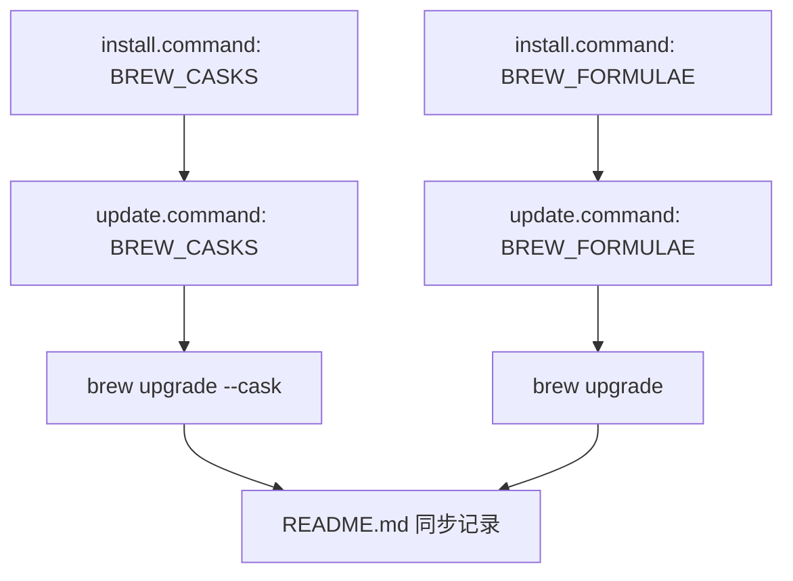

# `update.command`


[toc]

---

## 🔥 <font id=前言>前言</font> <a href="#🔚" style="font-size:17px; color:green;"><b>🔽</b></a>

- 采用 Shell 脚本的原因：Shell 来自 [**macOS**](https://www.apple.com/macos/) 原生系统底层，虽然写法相对繁琐冗杂，但执行效率高，并且不需要额外介入 [**Ruby**](https://www.ruby-lang.org)、[**Python**](https://www.python.org) 等第三方运行环境，因此具备更好的移植性。

`update.command` 用于升级和维护 `install.command` 已安装 / 初始化过的 [**macOS**](https://www.apple.com/macos/) 开发环境。

核心原则：

```text
install.command 安装 / 初始化过的内容，update.command 必须体现，并提供升级 / 刷新入口。
```

该脚本适合 `.command` 双击运行，也可以在终端中执行。启动后会先显示脚本内置自述，再按照更新顺序逐项询问。

## 一、运行方式 <a href="#前言" style="font-size:17px; color:green;"><b>🔼</b></a> <a href="#🔚" style="font-size:17px; color:green;"><b>🔽</b></a>

进入 `update.command` 所在目录后执行：

```zsh
./update.command
```

如果已经自行加入 `PATH`，也可以执行：

```zsh
update.command
update.command [参数...]
```

托管模式用于确认当前就是要完整升级，适合放着跑：

```zsh
./update.command -t
update.command -t
update.command --unattended
```

托管模式会跳过脚本自述确认、自动执行所有更新项、启动时执行一次 `sudo -v` 让用户输入管理员密码，并在脚本运行期间保活 sudo 凭证。遇到 [**Homebrew**](https://brew.sh/) `Do you want to proceed with the upgrade? [y/n]` 这类已知确认点时，会定点输入 `y`。

## 二、交互规则 <a href="#前言" style="font-size:17px; color:green;"><b>🔼</b></a> <a href="#🔚" style="font-size:17px; color:green;"><b>🔽</b></a>

`update` 本身就是升级入口，所以普通更新项采用：

```text
直接回车：执行升级 / 刷新
输入任意字符后回车：跳过当前项
```

单个更新项失败不会阻断后续更新项，只会写入日志并继续后续流程。

工具不存在时，`update.command` 默认只提示，不静默安装。需要补装请回到 `install.command`。

托管模式参数：

```zsh
-t
--trust
--unattended
```

托管模式等价于逐项选择执行，不等价于关闭外部工具的所有安全提示。系统弹窗、图形化授权、网络失败重试、第三方安装器额外交互仍可能需要人工处理。

脚本内置自述可通过环境变量跳过：

```zsh
JOBS_MAC_ENV_SKIP_README=1 ./update.command
```

## 三、与 `install.command` 的对应关系 <a href="#前言" style="font-size:17px; color:green;"><b>🔼</b></a> <a href="#🔚" style="font-size:17px; color:green;"><b>🔽</b></a>

当前 `update.command` 已对齐 `install.command` 的这些安装 / 初始化项，并且按 `update.command` 实际询问顺序排列：

- [**Xcode Command Line Tools**](https://developer.apple.com/xcode/resources/) / [`softwareupdate`](https://support.apple.com/guide/terminal/install-system-software-updates-apdc2ebf20d5/mac)
  - 对应更新：检查 CLT、接受 [**Xcode**](https://developer.apple.com/xcode/) License、执行 `softwareupdate --install --all`
- [**Xcode**](https://developer.apple.com/xcode/) iOS 平台组件
  - 对应更新：清理 Xcode / CoreSimulator 缓存，执行 `xcodebuild -downloadPlatform iOS -verbose`
- [**Oh My Zsh**](https://ohmyz.sh/)
  - 对应更新：执行 `~/.oh-my-zsh/tools/upgrade.sh`
- [**Homebrew**](https://brew.sh/)
  - 对应更新：执行 `brew update`、`brew upgrade`、`brew upgrade --cask`、`brew cleanup`、`brew doctor`、`brew -v`
  - 容错处理：`brew update` 遇到 `formulae.brew.sh/api` 或 `.jws.json` 下载失败时，自动使用 `HOMEBREW_NO_INSTALL_FROM_API=1 brew update` 降级重试
  - 信任处理：全局 `brew upgrade` 前会先处理脚本维护的第三方 tap，避免 Homebrew 扫描阶段提前跳过 `fvm` 等非官方 formula
  - 托管处理：`-t` 模式下会对 `brew upgrade` / `brew upgrade --cask` 的 `[y/n]` 确认自动输入 `y`
  - `brew cask`：由 `BREW_CASKS` 自动生成逐项升级入口
  - `brew formula`：由 `BREW_FORMULAE` 自动生成逐项升级入口
  - `github-store`：升级前确认 `OpenHub-Store/tap`，升级后对 `$APPLICATIONS_DIR/GitHub-Store.app` 执行 `xattr -dr com.apple.quarantine`
- [**Rosetta 2**](https://support.apple.com/en-us/102527)
  - 对应更新：检查安装状态；Rosetta 2 通常跟随 [**macOS**](https://www.apple.com/macos/) 系统更新维护
- [**FVM**](https://fvm.app/) / [**Flutter**](https://flutter.dev/)
  - 对应更新：FVM 复用统一的 `brew formula` 升级逻辑，先处理 `leoafarias/fvm` tap 信任与确认，再执行外部 `flutter upgrade` / `flutter doctor -v`；否则回退到 `fvm flutter doctor -v`
- [**Node.js**](https://nodejs.org/) / [**Corepack**](https://nodejs.org/api/corepack.html) / [**npm**](https://www.npmjs.com/) / [**pnpm**](https://pnpm.io/)
  - 对应更新：兼容 [**nvm**](https://github.com/nvm-sh/nvm) LTS 维护，启用 `corepack`，升级 `npm`
- `npm` 全局包：[**quicktype**](https://quicktype.io/)
  - 对应更新：检测已安装后执行 `sudo npm update -g quicktype`
- `npm` 全局包：[**OpenCLI**](https://www.npmjs.com/package/@jackwener/opencli)
  - 对应更新：确认 [**Node.js**](https://nodejs.org/) 版本不低于 21，检测已安装后执行 `sudo npm install -g @jackwener/opencli@latest`，并提示 `opencli doctor`
- `npm` 全局包：[**CodeGraph**](https://github.com/colbymchenry/codegraph)
  - 对应更新：检测已安装后执行 `npm install -g @colbymchenry/codegraph@latest`，输出版本，并执行 `codegraph install --yes` 刷新 Agent 配置
- [**Ruby**](https://www.ruby-lang.org/) / [**RubyGems**](https://rubygems.org/) / [**rbenv**](https://github.com/rbenv/rbenv)
  - 对应更新：刷新 `rbenv` 初始化配置，执行 `rbenv rehash`、`gem update --system`、`gem update`
- `gem` 包：[**CocoaPods**](https://cocoapods.org/)
  - 对应更新：检测已安装后执行 `sudo gem update cocoapods`、`pod repo update`
- [**Python**](https://www.python.org/) / [**pip**](https://pip.pypa.io/) / [**uv**](https://docs.astral.sh/uv/)
  - 对应更新：按可用环境执行 `pyenv update`、`pyenv rehash`、`pipx upgrade-all`、`python3 -m pip install --upgrade pip`
- [**Dart**](https://dart.dev/) `pub` 缓存
  - 对应更新：执行 `dart pub global list`、`dart pub cache repair`
- [**Git LFS**](https://git-lfs.com/) 初始化
  - 对应更新：执行 `git lfs install`，刷新 `core.compression`、`http.postBuffer` 等大文件相关 [**Git**](https://git-scm.com/) 参数
- [**JobsKits**](https://github.com/JobsKits) 仓库
  - 对应更新：`JobsSoftware.MacOS`、`JobsMacEnvVarConfig` 执行 `git pull --ff-only`
  - 对应保护：只确认 `JobsMacEnvVarConfig/install.command` 可执行权限，不执行它，避免递归调用安装入口
- 手动下载 / 更新页面
  - [**Visual Studio Code**](https://code.visualstudio.com/)
  - [**Android Studio**](https://developer.android.com/studio?hl=zh-cn)
  - [**Python Downloads**](https://www.python.org/downloads/)

## 四、Homebrew 第三方配置 <a href="#前言" style="font-size:17px; color:green;"><b>🔼</b></a> <a href="#🔚" style="font-size:17px; color:green;"><b>🔽</b></a>

`update.command` 内部保留与 `install.command` 同源的数组。

### 4.1、`brew cask`

当前 `BREW_CASKS`：

```zsh
readonly -a BREW_CASKS=(
  hammerspoon
  flutter
  trex
  vlc
  jdownloader
  codex-app
  codex
  github-store
  jtool2
  motrix
  onlyoffice
  pot
  qlcolorcode
  temurin@17
)
```

| cask | 说明 |
| --- | --- |
| [**hammerspoon**](https://www.hammerspoon.org/) | 自动化与快捷键工具 |
| [**flutter**](https://flutter.dev/) | Flutter SDK / 桌面开发工具链 |
| [**trex**](https://formulae.brew.sh/cask/trex) | OCR / 取词相关工具 |
| [**vlc**](https://www.videolan.org/vlc/) | 视频播放器 |
| [**jdownloader**](https://formulae.brew.sh/cask/jdownloader) | 下载管理工具 |
| [**codex-app**](https://formulae.brew.sh/cask/codex-app) | Codex 图形化应用入口 |
| [**codex**](https://formulae.brew.sh/cask/codex) | Codex 相关图形化入口 |
| `github-store` | GitHub-Store 图形化应用入口；来自 `OpenHub-Store/tap` |
| `jtool2` | iOS / Mach-O 辅助工具 |
| [**motrix**](https://motrix.app/) | 下载管理工具 |
| [**onlyoffice**](https://www.onlyoffice.com/) | Office 文档套件 |
| [**pot**](https://pot-app.com/) | 翻译工具 |
| [**qlcolorcode**](https://github.com/sbarex/QLColorCode) | Quick Look 代码预览 |
| `temurin@17` | Eclipse Temurin JDK 17 |

### 4.2、`brew formula`

当前 `BREW_FORMULAE`：

```zsh
readonly -a BREW_FORMULAE=(
  agg
  asciinema
  caddy
  cloudflared
  git-lfs
  gh
  nushell
  rbenv
  ruby
  node
  jenv
  openjdk
  openjdk@17
  openjdk@21
  fvm
  pnpm
  python
  python3
  python-tk@3.14
  pyinstaller
  pyside
  cocoapods
  fastlane
  mysql
  hugo
  yt-dlp
  ffmpeg
  cmake
  graphviz
  sevenzip
  go-task
  uv
  fzf
  glow
  lazygit
  dufs
  git-filter-repo
  nginx
  radare2
)
```

| formula | 说明 |
| --- | --- |
| [**agg**](https://github.com/asciinema/agg) | asciinema 录制转 GIF / 视频 |
| [**asciinema**](https://asciinema.org/) | 终端录制工具 |
| [**caddy**](https://caddyserver.com/) | Web 服务器 / 反向代理 |
| [**cloudflared**](https://github.com/cloudflare/cloudflared) | Cloudflare Tunnel 工具 |
| [**git-lfs**](https://git-lfs.com/) | Git 大文件支持 |
| [**gh**](https://cli.github.com/) | GitHub CLI |
| [**nushell**](https://www.nushell.sh/) | 结构化 Shell |
| [**rbenv**](https://github.com/rbenv/rbenv) | Ruby 版本管理 |
| [**ruby**](https://www.ruby-lang.org/) | Ruby 运行环境 |
| [**node**](https://nodejs.org/) | Node.js 运行环境 |
| [**jenv**](https://www.jenv.be/) | Java 版本管理 |
| [**openjdk**](https://openjdk.org/) | Java 开发工具包 |
| [**openjdk@17**](https://openjdk.org/projects/jdk/17/) | Java 17 开发工具包 |
| `openjdk@21` | Java 21 开发工具包 |
| [**fvm**](https://fvm.app/) | Flutter 版本管理 |
| [**pnpm**](https://pnpm.io/) | Node.js 包管理器 |
| [**python**](https://www.python.org/) | Python 运行环境 |
| [**python3**](https://www.python.org/) | Python 3 运行环境 |
| `python-tk@3.14` | Python Tk 运行组件 |
| [**pyinstaller**](https://pyinstaller.org/) | Python 应用打包工具 |
| [**pyside**](https://formulae.brew.sh/formula/pyside) | Qt 官方 Python 绑定；代码中使用 `PySide6` 导入 |
| [**cocoapods**](https://cocoapods.org/) | iOS 依赖管理工具 |
| [**fastlane**](https://fastlane.tools/) | 移动端自动化发布工具 |
| [**mysql**](https://www.mysql.com/) | MySQL 数据库 |
| [**hugo**](https://gohugo.io/) | 静态站点生成器 |
| [**yt-dlp**](https://github.com/yt-dlp/yt-dlp) | 视频下载工具 |
| [**ffmpeg**](https://ffmpeg.org/) | 音视频处理工具 |
| [**cmake**](https://cmake.org/) | 跨平台构建工具 |
| [**graphviz**](https://graphviz.org/) | Graphviz 图形渲染工具 |
| [**sevenzip**](https://formulae.brew.sh/formula/sevenzip) | 7-Zip 压缩 / 解压工具 |
| [**go-task**](https://taskfile.dev/) | 任务运行器 |
| [**uv**](https://docs.astral.sh/uv/) | Python 包与项目管理工具 |
| [**fzf**](https://github.com/junegunn/fzf) | 命令行模糊查找工具 |
| [**glow**](https://github.com/charmbracelet/glow) | 终端 Markdown 阅读器 |
| [**lazygit**](https://github.com/jesseduffield/lazygit) | Git 终端 UI |
| [**dufs**](https://github.com/sigoden/dufs) | 文件服务器工具 |
| [**git-filter-repo**](https://formulae.brew.sh/formula/git-filter-repo) | Git 仓库历史重写 / 清理工具 |
| [**nginx**](https://nginx.org/) | Web 服务器 / 反向代理 |
| [**radare2**](https://www.radare.org/n/) | 逆向分析工具 |

维护规则：

```text
install.command 增加 brew cask / formula 后，update.command 的同名数组必须同步增加；对应 README.md 也必须同步更新。
```

少数特殊 `cask` 的 tap 与更新后置动作已经适配：

- `github-store`：升级前执行 `brew tap OpenHub-Store/tap` 确认 tap；检测已安装后执行 `brew upgrade --cask github-store`；升级后执行 `xattr -dr com.apple.quarantine $APPLICATIONS_DIR/GitHub-Store.app`
- `vlc`：如果 Homebrew 未登记 `vlc`，但本机已经存在 `/Applications/VLC.app`，更新入口会识别为本机已有 App 并跳过升级提示。

少数特殊 `formula` 的更新后置动作已经适配：

- [**fvm**](https://fvm.app/)：自动确认 `leoafarias/fvm` tap；如果当前 Homebrew 开启 tap trust 策略，会先执行 `brew trust leoafarias/fvm`
- [**go-task**](https://taskfile.dev/)：自动确认 `go-task/tap`，并使用 `go-task/tap/go-task` 升级
- [**rbenv**](https://github.com/rbenv/rbenv)：升级后刷新 `rbenv` 初始化配置
- [**jenv**](https://www.jenv.be/)：升级后刷新 `jenv` 初始化配置
- [**openjdk**](https://openjdk.org/) / [**openjdk@17**](https://openjdk.org/projects/jdk/17/)：升级后输出 Java 配置提示
- [**fzf**](https://github.com/junegunn/fzf)：升级后刷新 `fzf` shell 配置

## 五、更新顺序总览 <a href="#前言" style="font-size:17px; color:green;"><b>🔼</b></a> <a href="#🔚" style="font-size:17px; color:green;"><b>🔽</b></a>

`update.command` 当前按以下顺序逐项询问：

1. [**Xcode Command Line Tools**](https://developer.apple.com/xcode/resources/) / `softwareupdate`
2. [**Xcode**](https://developer.apple.com/xcode/) iOS 平台组件
3. [**Oh My Zsh**](https://ohmyz.sh/)
4. [**Homebrew**](https://brew.sh/)
5. `brew cask` 批量升级
6. `brew formula` 批量升级
7. [**Rosetta 2**](https://support.apple.com/en-us/102527) 状态检查
8. [**FVM**](https://fvm.app/) / [**Flutter**](https://flutter.dev/)
9. [**Node.js**](https://nodejs.org/) / `corepack` / `npm`
10. `npm` 全局包：[**quicktype**](https://quicktype.io/)
11. `npm` 全局包：[**OpenCLI**](https://www.npmjs.com/package/@jackwener/opencli)
12. `npm` 全局包：[**CodeGraph**](https://github.com/colbymchenry/codegraph)
13. [**Ruby**](https://www.ruby-lang.org/) / [**RubyGems**](https://rubygems.org/)
14. [**CocoaPods**](https://cocoapods.org/)
15. [**Python**](https://www.python.org/) / `pip`
16. [**Dart**](https://dart.dev/) `pub` 缓存
17. [**Git LFS**](https://git-lfs.com/) 初始化刷新
18. [**JobsKits**](https://github.com/JobsKits) 仓库
19. 手动下载 / 更新页面

### 5.1、CodeGraph 升级说明

[**CodeGraph**](https://github.com/colbymchenry/codegraph) 通过 `npm` 安装时，升级方式采用覆盖安装到最新版本：

```zsh
npm install -g @colbymchenry/codegraph@latest
codegraph --version
codegraph install --yes
```

其中 `codegraph install --yes` 用于刷新 Claude Code / Cursor / Codex CLI / opencode / Hermes Agent 等 Agent 的 MCP 配置和说明文件；项目内 `.codegraph/codegraph.db` 不会在全局升级时强制重建，需要进入具体项目后按需执行：

```zsh
codegraph index --force
```

## 六、风险说明 <a href="#前言" style="font-size:17px; color:green;"><b>🔼</b></a> <a href="#🔚" style="font-size:17px; color:green;"><b>🔽</b></a>

以下步骤可能耗时较长或触发系统级行为：

```text
sudo softwareupdate --install --all
sudo xcodebuild -license accept
xcodebuild -downloadPlatform iOS -verbose
HOMEBREW_NO_INSTALL_FROM_API=1 brew update
brew trust --tap leoafarias/fvm
brew upgrade / brew upgrade --cask
xattr -dr com.apple.quarantine $APPLICATIONS_DIR/GitHub-Store.app
gem update / npm install -g npm@latest
npm install -g @colbymchenry/codegraph@latest
codegraph install --yes
dart pub cache repair
```

脚本会在执行每个大项前单独询问。

## 七、日志文件 <a href="#前言" style="font-size:17px; color:green;"><b>🔼</b></a> <a href="#🔚" style="font-size:17px; color:green;"><b>🔽</b></a>

运行日志固定写入：

```text
$TMPDIR/update.log
```

## 八、结构约定 <a href="#前言" style="font-size:17px; color:green;"><b>🔼</b></a> <a href="#🔚" style="font-size:17px; color:green;"><b>🔽</b></a>

运行时说明和核心流程已经写在 `update.command` 内部，不依赖同级 `README.md`。

本 README 用于源码浏览、维护说明和当前流程说明。

`update.command` 当前通过 `jobs_update_main` 统一收口：

```zsh
jobs_update_show_readme_and_wait
update "$@"
```

如果脚本被其他脚本 `source`，可以通过 `JOBS_MAC_ENV_SOURCE_MODE=1` 避免自动执行主流程。

## 九、流程图 <a href="#前言" style="font-size:17px; color:green;"><b>🔼</b></a> <a href="#🔚" style="font-size:17px; color:green;"><b>🔽</b></a>


`brew` 数组对齐关系：



<a id="🔚" href="#前言" style="font-size:17px; color:green; font-weight:bold;">我是有底线的➤点我回到首页</a>
