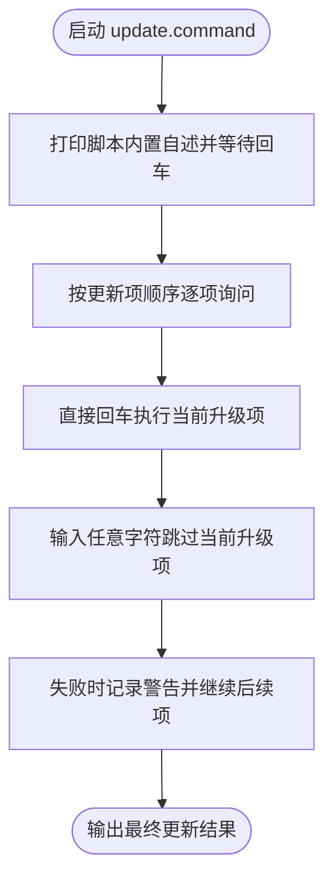
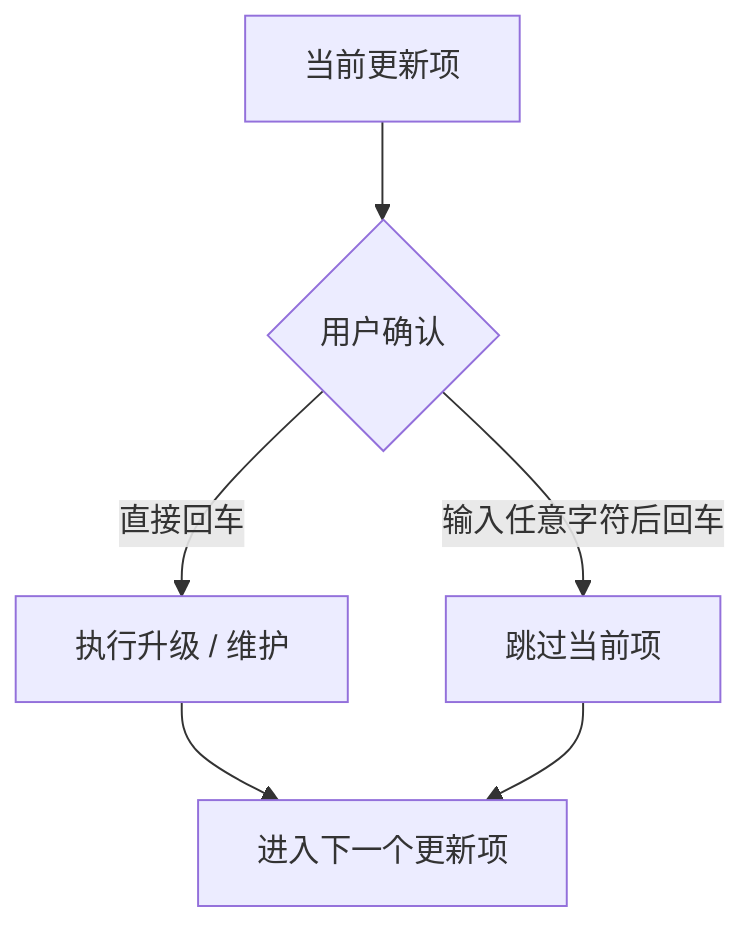

# update.command

[toc]

## 一、功能

通过交互菜单批量更新 Homebrew、Flutter、Node、Python、Ruby、CocoaPods、Dart pub 缓存等开发工具链。

该脚本适合 `.command` 双击运行，也可以在终端中执行。启动后的说明展示、依赖检查和核心流程都写在脚本内部。

## 二、运行

```zsh
./update.command
```

如果已经自行加入 PATH，也可以执行：

```zsh
update
update [参数...]
```

## 三、菜单顺序

当前更新项顺序如下：

```text
Homebrew：brew update / brew upgrade / brew cleanup / brew doctor
FVM / Flutter：升级 FVM，执行 flutter upgrade / flutter doctor
Node：使用 nvm 更新 LTS，启用 corepack
Python：pyenv update、pipx upgrade-all、pip 自升级
Ruby：rbenv rehash、gem update
CocoaPods：pod repo update
Dart pub 缓存：dart pub cache repair
```

## 四、交互规则

`update` 本身就是升级入口，所以普通更新项采用“直接回车执行升级，输入任意字符后回车跳过”。单个更新项失败不会阻断后续更新项。

## 五、结构约定

运行时说明和核心流程已经写在 `update.command` 内部，不依赖同级 `README.md`。

本 README 只用于源码浏览、维护说明和当前流程说明。

## 六、流程图



普通更新项确认逻辑：


