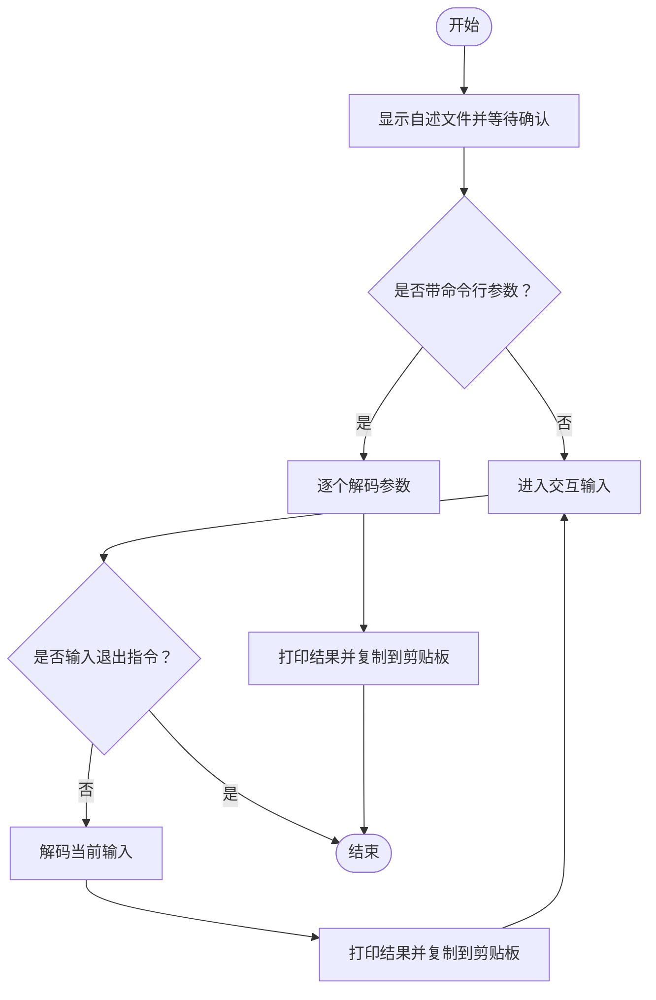

# **MacOS** JobsMacEnv - **去乱码 / URL 解码工具**

<p align="left">
  <a></a>
  <a></a>
  <a></a>
</p>


[toc]

## 🔥 <font id=前言>前言</font>

> 当前总行数：

* 🔧 **工欲善其事必先利其器**

* 🌋 **站在巨人的肩膀上，才能看得更远**

* ✝️ **面向信仰编程**

* 本文是 `【MacOS】去乱码.command` 的脚本自述文件。

* 通过极简命令 `flat` 对 URL 编码文本执行解码，把 `%E4%B8%AD%E6%96%87` 这类内容还原成可读中文。

* 解码结果会自动复制到 macOS 系统剪贴板，便于继续粘贴使用。

* 双击 `.command` 脚本运行时，会先显示自述文件并等待用户按回车，避免误操作。

## 一、🎯 项目白皮书 <a href="#前言" style="font-size:17px; color:green;"><b>🔼</b></a> <a href="#🔚" style="font-size:17px; color:green;"><b>🔽</b></a>

脚本定位：

* 脚本文件：`【MacOS】去乱码.command`
* 所属目录：`Scripts/【MacOS】去乱码.command/`
* 推荐入口：`flat`
* 核心能力：URL Decode、表单编码 Decode、自动复制剪贴板
* 日志路径：`/tmp/【MacOS】去乱码.log`

## 二、🧭 脚本执行流程 <a href="#前言" style="font-size:17px; color:green;"><b>🔼</b></a> <a href="#🔚" style="font-size:17px; color:green;"><b>🔽</b></a>



## 三、🧩 功能清单 <a href="#前言" style="font-size:17px; color:green;"><b>🔼</b></a> <a href="#🔚" style="font-size:17px; color:green;"><b>🔽</b></a>

### 1、显示自述文件并等待确认

启动后先打印当前 README，并等待用户按回车继续。

### 2、URL 编码解码

默认使用标准 URL Decode：

```text
%E4%BD%A0%E5%A5%BD -> 你好
```

### 3、表单编码解码

传入 `--plus` 后，会把 `+` 解析为空格，适合处理表单编码：

```text
hello+world%21 -> hello world!
```

### 4、自动复制结果

解码结果会通过 `pbcopy` 写入系统剪贴板。

### 5、运行日志

所有关键输出会写入：

```text
/tmp/【MacOS】去乱码.log
```

## 四、🚀 使用方式 <a href="#前言" style="font-size:17px; color:green;"><b>🔼</b></a> <a href="#🔚" style="font-size:17px; color:green;"><b>🔽</b></a>

### 1、双击执行

在 Finder 中双击：

```shell
Scripts/【MacOS】去乱码.command/【MacOS】去乱码.command
```

### 2、终端交互执行

```shell
flat
```

### 3、直接解码参数

```shell
flat "%E4%BD%A0%E5%A5%BD"
```

### 4、表单编码模式

```shell
flat --plus "hello+world%21"
```

## 五、⚠️ 常见问题 <a href="#前言" style="font-size:17px; color:green;"><b>🔼</b></a> <a href="#🔚" style="font-size:17px; color:green;"><b>🔽</b></a>

### 1、这个脚本解决的“乱码”是什么？

主要解决 URL 百分号编码文本的可读性问题，例如浏览器地址、接口参数、日志里的 `%E4%B8%AD%E6%96%87`。

### 2、为什么有 `--plus`？

普通 URL Decode 不会把 `+` 当成空格；表单编码常用 `+` 表示空格，所以单独提供 `--plus`。

### 3、为什么每个脚本都单独放一个同名文件夹？

这样可以把脚本、自述文件和未来扩展资源放在同一处，避免 Scripts 目录长期失控。

## 六、✅ 总结 <a href="#前言" style="font-size:17px; color:green;"><b>🔼</b></a> <a href="#🔚" style="font-size:17px; color:green;"><b>🔽</b></a>

`【MacOS】去乱码.command` 采用独立目录管理，通过 `flat` 提供 URL Decode 快捷入口，适合处理浏览器、接口、日志中的编码文本。

<a id="🔚" href="#前言" style="font-size:17px; color:green; font-weight:bold;">我是有底线的➤点我回到首页</a>

> 说明：脚本运行时展示的自述已内置在 `.command` 脚本中，不读取本 README.md；本文件仅用于仓库/文件夹阅读。
